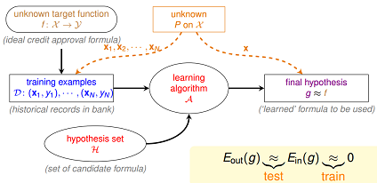
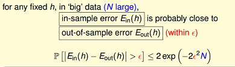
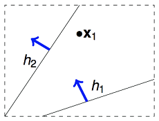
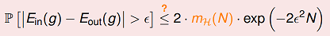

## Hoeffding不等式
Hoeffding不等式是关于一组随机变量均值的概率不等式. 设 \\(X_1,X_2,\cdots,X_n\\) 为一组随机变量, a_i\leq X_i\leq b_i, 定义一组随机变量的均值为：

[Hoeffding不等式](http://science.scileaf.com/library/2461)

**case示例**：

在统计推断中，我们可以利用样本的统计量(statistic)来推断总体的参数(parameter)，譬如使用样本均值来估计总体期望。

直觉上，如果我们有更多的样本(抽出更多的球)，则样本期望应该越来越接近总体期望。

## Connection to Learning
机器学习中的概念定义：
f 表示理想的方案，g 表示我们求解的用来预测的假设。
H 是假设空间。
通过算法A，在假设空间H 中选择最好的假设作为g。
选择标准是 g 近似于 f。

拿perceptron来举例

感知机（perceptron）是一个线性分类器(linear classifiers）。
线性分类器的几何表示：直线、平面、超平面。

上式 就是perceptron的假设空间。

上式 是感知器的优化目标。

f(x)表示理想目标函数，h(x)是我们预估的目标函数。

Eout(h)，我们可以理解为在理想情况下(已知f)，总体(out-of-sample)的损失(这里是0-1 loss)的期望，称作expected loss。
Ein(h)，可以理解为在训练样本上(in-of-sample)，损失的期望，称作expirical loss。

从上面式子可以看到，当样本量N足够大，且样本是独立同分布的，我们可以通过样本集上的expirical loss Ein(h)推测expected loss Eout(h)。

根据hoeffding不等式，我们可以推断N足够大时，expected loss和expirical loss将非常接近。

如果我们的假设空间H，有M个假设函数。

那么对于这M个假设：
$$
P(|Ein(h1)-Eout(h1)| or |Ein(h2)-Eout(h2)| ... |Ein(hm)-Eout(hm)|)
<= P(|Ein(h1)-Eout(h1)) + P(|Ein(h2)-Eout(h2)|) + ... + P(|Ein(hm)-Eout(hm)|)
<= 2M\exp(-2e^2N)
$$

**什么情况下Learning是可行的**？

1. 如果假设空间|H|=M是有限的，N足够大，那么对假设空间中任意一个g，Eout(g)=Ein(g)
2. 利用算法A从假设空间中，挑选出一个g，使得Ein(g)=0，那么probably approximately correct而言，Eout(g)也接近为0

## 学习可行的两个核心问题

M取值的trade off

假设空间size H的大小很关键。M太小，第二项不能满足，M太大，第一项不能满足。

虽说假设空间很大，上面式子中，我们用到了P(h1 or h2 ... hm) <= P(h1) + P(h2) + ... + P(hm)。但事实上，多个h之间并不是完全独立的，他们是有很大的重叠的。

譬如说，我们的算法要在平面上(二维空间)挑选一条直线方程作为g，用来划分一个点x1。假设空间H是所有的直线，这个size M是无限多的。但是实际上可以将这些直线分为两类，一类是把x1判断为正例的，另一类是把x1判断为负例的。如下图所示：

那如果在平面上有两个数据点x1,x2，这样的话，假设空间H中的无数条直线可以分为4类。那依次类推，有3个数据点，H中最多有8类直线，4个数据点，H中最多有14类直线(注意：为什么不是16类直线)。

## Effective Number of Hypotheses

从H中任意选择一个方程h，让这个h对样本集合进行二元分类，输出一个结果向量。例如对4个点进行预测，输出为{1,1,1,0}，这样一个输出向量我们即为一个dichotomies。

如果有N个样本数据，那么effective(N) = H作用于样本集D"最多"能产生多少不同的dichotomy。

用effective(N)来替换M。

## Growth Function

H作用于D"最多"能产生多少种不同的idchotomy？这个数量与H有关，跟数据量N也有关。用数学公式可以表达为：

max|H(x1,x2,...,xN)|

这个式子又称为"成长函数"。在H确定的情况下，growth function是一个与N相关的函数。

## Break Point概念

Shatter的概念：当H作用于N个input的样本集时，产生的dichotomies数量等于这N个点总的组合数2^N是，就称：这N个inputs被H给shatter掉了。

要注意到 shatter 的原意是「打碎」，在此指「N 個点的所有(碎片般的)可能情形都被H产生了」。所以m_H(N)=2N 的情形是「shatter」。

对于给定的成长函数m_H(N)，从N=1出发，N慢慢变大，当增大到k时，出现m_H(N) < 2^k的情形，则我们说k是该成长函数的break point。对于任何N>k个inputs而言，H都没有办法再shatter他们了。

## VC Bound
成长函数的上界B(N,k)都被bound住了，那我们的成长函数同样也可以被这个bound住，因此对于存在break point k的成长函数而言，

m_H ≤ \sum_{i=0}^{k−1}(N i)

方程的数量看上去是无穷的，但真正有效(effective)的方程的数量却是有限的

## VC dimension

Vladimir Vapnik与Alexey Chervonenkis [Vapnik–Chervonenkis theory](http://en.wikipedia.org/wiki/Vapnik%E2%80%93Chervonenkis_theory)

一个H的VC dimension即为d_vc(H)，是这个H最多能够shatter掉的点的数量。如果不管多少个点H都能shatter他们，则d_vc(H)=无穷大。

k = d_vc(H) + 1

[vc-dimension-two](http://beader.me/mlnotebook/section2/vc-dimension-two.html)

[vc-dimension-three](http://beader.me/mlnotebook/section2/vc-dimension-three.html)

## 深度学习
以前VC dimension很高，但是样本很少，所以在out of sample的表现不是很好。

但现在为什么强了，因为大数据，训练数据量越来越大，然后随着机器计算水平的提升，所以深度学习得到一个流行。

