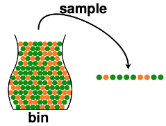
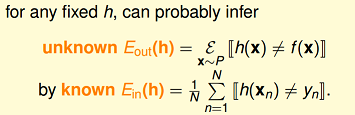
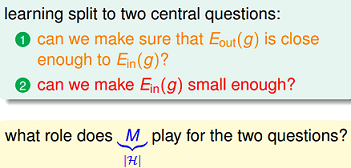
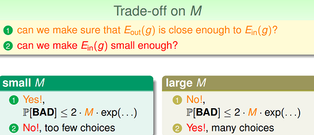
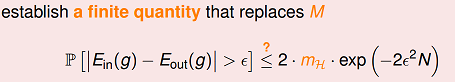
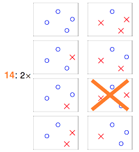
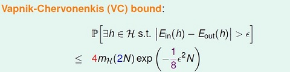
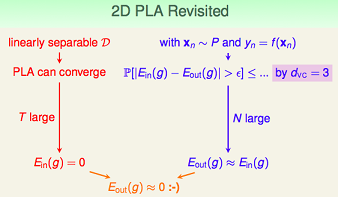
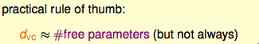
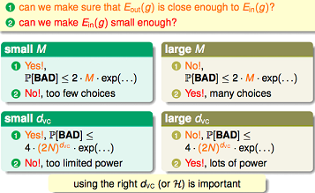

## Hoeffding不等式
Hoeffding不等式是关于一组随机变量均值的概率不等式。
如果\\(X_1,X_2,\cdots,X_n\\)为一组独立同分布的参数为p的伯努利分布随机变量。定义这组随机变量的均值为：

$$\bar X=\frac{X_1+X_2+\cdots+X_n}{n}$$

对于任意\\(\delta>0\\), Hoeffding不等式可以表示为

$$P(|\bar X - E(\bar X)| \geq \delta) \leq \exp(-2\delta^2n^2)$$

更多请参考:[Hoeffding不等式](http://science.scileaf.com/library/2461)，[集中不等式](http://zh.wikipedia.org/zh-cn/集中不等式)

**case示例**：

在统计推断中，我们可以利用样本的统计量(statistic)来推断总体的参数(parameter)，譬如使用样本均值来估计总体期望。

直觉上，如果我们有更多的样本(抽出更多的球)，则样本期望\\(\nu\\)应该越来越接近总体期望\\(\mu\\)。

## Connection to Learning
机器学习中的概念定义：
f 表示理想的方案，g 表示我们求解的用来预测的假设。
H 是假设空间。
通过算法A，在假设空间H 中选择最好的假设作为g。
选择标准是 g 近似于 f。

拿perceptron来举例

感知机（perceptron）是一个线性分类器(linear classifiers）。
线性分类器的几何表示：直线、平面、超平面。

上式 就是perceptron的假设空间。

上式 是感知器的优化目标。

f(x)表示理想目标函数，h(x)是我们预估的目标函数。

Eout(h)，我们可以理解为在理想情况下(已知f)，总体(out-of-sample)的损失(这里是0-1 loss)的期望，称作expected loss。

Ein(h)，可以理解为在训练样本上(in-of-sample)，损失的期望，称作expirical loss。

从上面式子可以看到，当样本量N足够大，且样本是独立同分布的，我们可以通过样本集上的expirical loss Ein(h)推测expected loss Eout(h)。

根据hoeffding不等式，我们可以推断N足够大时，expected loss和expirical loss将非常接近。

如果我们的假设空间H，有M个假设函数。

那么对于这M个假设：

$$P(|E_{in}(h_1)-E_{out}(h_1)|>\epsilon  \cup |E_{in}(h_2)-E_{out}(h_2)| > \epsilon   ... |E_{in}(h_m)-E_{out}(h_m)|>\epsilon)
\leq P(|E_{in}(h_1)-E_{out}(h_1)|>\epsilon) + P(|E_{in}(h_2)-E_{out}(h_2)|>\epsilon) + ... + P(|E_{in}(h_m)-E_{out}(h_m)|>\epsilon)
\leq 2M\exp(-2 \epsilon^2 N)$$

**什么情况下Learning是可行的**？

1. 如果假设空间H的size M是有限的，N足够大，那么对假设空间中任意一个g，Eout(g)=Ein(g)
2. 利用算法A从假设空间中，挑选出一个g，使得Ein(g)=0，那么probably approximately correct而言，Eout(g)也接近为0

## 学习可行的两个核心问题

M取值的trade off

假设空间H的大小M很关键。M太小，第二项不能满足，M太大，第一项不能满足。

虽说假设空间很大，上面式子中，我们用到了P(h1 or h2 ... hm) <= P(h1) + P(h2) + ... + P(hm)。但事实上，多个h之间并不是完全独立的，他们是有很大的重叠的。

譬如说，我们的算法要在平面上(二维空间)挑选一条直线方程作为g，用来划分一个点x1。假设空间H是所有的直线，这个size M是无限多的。但是实际上可以将这些直线分为两类，一类是把x1判断为正例的，另一类是把x1判断为负例的。如下图所示：

那如果在平面上有两个数据点x1,x2，这样的话，假设空间H中的无数条直线可以分为4类。那依次类推，有3个数据点，H中最多有8类直线，4个数据点，H中最多有14类直线(注意：为什么不是16类直线)。

## Effective Number of Hypotheses

从H中任意选择一个方程h，让这个h对样本集合进行二元分类，输出一个结果向量。例如对4个点进行预测，输出为{1,1,1,0}，这样一个输出向量我们即为一个dichotomies。

如果有N个样本数据，那么有效的Hypotheses个数：effective(N) = H作用于样本集D"最多"能产生多少不同的dichotomy。那么就可以用effective(N)来替换M。

下面是Hypotheses与dichotomies的对比：

## Growth Function

H作用于D"最多"能产生多少种不同的idchotomy？这个数量与H有关，跟数据量N也有关。用数学公式可以表达为：

max_H(x1,x2,...,xN)

这个式子又称为"成长函数"。在H确定的情况下，growth function是一个与N相关的函数。

下图举了4个例子，分别计算其growth function：

用m_H(N)替换effective(N)，如下所示：

## Break Point概念

Shatter的概念：当H作用于N个input的样本集时，产生的dichotomies数量等于这N个点总的组合数\\(2^N\\)是，就称：这N个inputs被H给shatter掉了。

要注意到 shatter 的原意是"打碎"，在此指"N个点的所有(碎片般的)可能情形都被H产生了"。所以\\( m_H(N)=2^N \\)的情形是"shatter"。

对于给定的成长函数m_H(N)，从N=1出发，N慢慢变大，当增大到k时，出现\\(m_H(N) < 2^k\\)的情形，则我们说k是该成长函数的break point。对于任何N > k个inputs而言，H都没有办法再shatter他们了。

## VC Bound
成长函数的上界，设为B(N,k)，意为：maximum possible m_H(N) when break point = k。

$$m_H(N) \leq \sum_{i=0}^{k−1}{N \choose i}$$

方程的数量看上去是无穷的，但真正有效(effective)的方程的数量却是有限的

这个式子显然是多项式的，最高次幂是 k-1。

所以我们得到结论：如果break point存在（有限的正整数），生长函数m(N) 是多项式的。

**可以直接替换吗**

既然得到了m(N) 的多项式上界，我们希望对之前的不等式中M 进行替换。

然而直接替换是存在问题的，具体解释和替换方法这里不多说了，可以去看林老师的课程。主要问题就是Eout(h)，out 的空间是无穷大的，通过将Eout 替换为验证集(verification set) 的Ein' 来解决这个问题。最后我们得到下面的VC bound:

## VC dimension

Vladimir Vapnik与Alexey Chervonenkis [Vapnik–Chervonenkis theory](http://en.wikipedia.org/wiki/Vapnik%E2%80%93Chervonenkis_theory)

一个H的VC dimension即为\\(d_{vc}(H)\\)，是这个H最多能够shatter掉的点的数量。如果不管多少个点H都能shatter他们，则\\(d_{vc}(H)\\)=无穷大。

$$ k = d_{vc}(H) + 1 $$

regardless of learning algorithm A 
regardless of input distribution P
regardless of target function f

感知器的dvc = d+1

VC维可以反映假设H 的强大程度(powerfulness)，VC 维越大，H也越强，因为它可以打散更多的点。

可以得到规律：VC 维与假设参数w 的自由变量数目大约相等。
dVC = #free parameters

上面的”模型复杂度“ 的惩罚(penalty)，基本表达了模型越复杂（VC维大），Eout 可能距离Ein 越远。

模型较复杂时(dvc 较大)，需要更多的训练数据。 理论上，数据规模N 约等于 10000*dvc（称为采样复杂性，sample complexity）；然而，实际经验是，只需要 N = 10*dvc.
造成理论值与实际值之差如此之大的最大原因是，VC Bound 过于宽松了，我们得到的是一个比实际大得多的上界。

theory: N = 10, 000d_VC; practice: N = 10d_VC

[vc-dimension-two](http://beader.me/mlnotebook/section2/vc-dimension-two.html)

[vc-dimension-three](http://beader.me/mlnotebook/section2/vc-dimension-three.html)

## 深度学习的VC维
以前VC dimension很高，但是样本很少，所以在out of sample的表现不是很好。

但现在为什么强了，因为大数据，训练数据量越来越大，然后随着机器计算水平的提升，所以深度学习得到一个流行。

