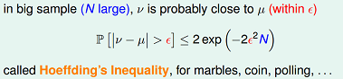
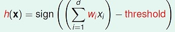
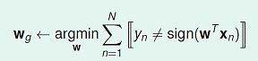
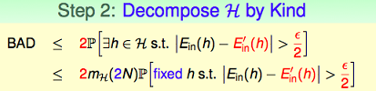

# VC维的来龙去脉
#### author: vincentyao@tencent.com

**目录：**

- 说说历史
- Hoeffding不等式
- Connection to Learning
- 学习可行的两个核心条件
- Effective Number of Hypotheses
- Growth Function
- Break Point与Shatter
- VC Bound
- VC dimension
- 深度学习与VC维
- Next

## 说说历史

1943年，模拟神经网络由麦卡洛可（McCulloch）和皮茨（Pitts)提出，他们分析了理想化的人工神经元网络，并且指出了它们进行简单逻辑运算的机制。

1957年，康奈尔大学的实验心理学家弗兰克·罗森布拉特(Rosenblatt)在一台IBM-704计算机上模拟实现了一种他发明的叫作"感知机"（Perceptron）的神经网络模型。神经网络与支持向量机都源自于感知机（Perceptron）。

1962年，罗森布拉特著作：《神经动力学原理：感知机和大脑机制的理论》（Principles of Neurodynamics: Perceptrons and the Theory of Brain Mechanisms）。

1969年，明斯基和麻省理工学院的另一位教授佩普特合作著作：《感知机：计算几何学》（Perceptrons: An Introduction to Computational Geometry)。在书中，明斯基和佩普特证明单层神经网络不能解决XOR（异或）问题。

1971年，V. Vapnik and A. Chervonenkis在论文"On the uniform convergence of relative frequencies of events to their probabilities"中提出**VC维**的概念。

1974年，V. Vapnik提出了结构风险最小化原则。

1974年，沃波斯（Werbos）的博士论文证明了在神经网络多加一层，并且利用“后向传播”（Back-propagation）学习方法，可以解决XOR问题。那时正是神经网络研究的低谷，文章不合时宜。

1982年，在加州理工担任生物物理教授的霍普菲尔德，提出了一种新的神经网络，可以解决一大类模式识别问题，还可以给出一类组合优化问题的近似解。这种神经网络模型后被称为霍普菲尔德网络。

1986年，Rummelhart与McClelland发明了神经网络的学习算法Back Propagation。

1992年，Vapnik等人提出了支持向量机(support vector machine)。神经网络是多层的非线性模型，支持向量机利用核技巧把非线性问题转换成线性问题。

1992\~2005年，SVM与Neural network之争，但被互联网风潮掩盖住了。

2006年，Hinton提出神经网络的Deep Learning算法。Deep Learning假设神经网络是多层的，首先用Restricted Boltzmann Machine（非监督学习）学习网络的结构，然后再通过Back Propagation（监督学习）学习网络的权值。

## Hoeffding不等式

Hoeffding不等式是关于一组随机变量均值的概率不等式。
如果\\(X_1,X_2,\cdots,X_n\\)为一组独立同分布的参数为p的伯努利分布随机变量。定义这组随机变量的均值为：

$$\bar X=\frac{X_1+X_2+\cdots+X_n}{n}$$

对于任意\\(\delta>0\\), Hoeffding不等式可以表示为

$$P(|\bar X - E(\bar X)| \geq \delta) \leq \exp(-2\delta^2n^2)$$

更多请参考:[Hoeffding不等式](http://science.scileaf.com/library/2461)，[集中不等式](http://zh.wikipedia.org/zh-cn/集中不等式)

**case示例**：

在统计推断中，我们可以利用样本的统计量(statistic)来推断总体的参数(parameter)，譬如使用样本均值来估计总体期望。

直觉上，如果我们有更多的样本(抽出更多的球)，则样本期望\\(\nu\\)应该越来越接近总体期望\\(\mu\\)。

## Connection to Learning
机器学习中的概念定义：
f 表示理想的方案，g 表示我们求解的用来预测的假设。
H 是假设空间。
通过算法A，在假设空间H中，根据样本集D，选择最好的假设作为g。
选择标准是 g 近似于 f。

拿[perceptron](http://zh.wikipedia.org/zh/感知器)来举例。

感知机（perceptron）是一个线性分类器(linear classifiers）。
线性分类器的几何表示：直线、平面、超平面。

perceptron的假设空间，用公式描述，如下所示：

感知器的优化目标如下式所示，w_g就是我们要求的最好的假设。

设定两个变量，如下图所示。(图中 f(x)表示理想目标函数，h(x)是我们预估得到的某一个目标函数)

Eout(h)，可以理解为在理想情况下(已知f)，总体(out-of-sample)的损失(这里是0-1 loss)的期望，称作expected loss。

Ein(h)，可以理解为在训练样本上(in-of-sample)，损失的期望，称作expirical loss。

当样本量N足够大，且样本是独立同分布的，类比于上面"抽球"的例子，可以通过样本集上的expirical loss Ein(h)推测expected loss Eout(h)。基于hoeffding不等式，我们得到下面式子：

根据hoeffding不等式，我们可以推断N足够大时，expected loss和expirical loss将非常接近。

注意在上面推导中，我们是针对某一个特定的解h(x)。在我们的假设空间H中，往往有很多个假设函数(甚至于无穷多个)，这里我们先假定H中M个假设函数。

那么对于整个假设空间，也就是这M个假设函数，可以推导出下面不等式：

$$P(|E_{in}(h_1)-E_{out}(h_1)|>\epsilon  \cup |E_{in}(h_2)-E_{out}(h_2)| > \epsilon   ... |E_{in}(h_m)-E_{out}(h_m)|>\epsilon)$$
$$\leq P(|E_{in}(h_1)-E_{out}(h_1)|>\epsilon) + P(|E_{in}(h_2)-E_{out}(h_2)|>\epsilon) + ... + P(|E_{in}(h_m)-E_{out}(h_m)|>\epsilon)$$
$$\leq 2M\exp(-2 \epsilon^2 N)$$

注意上面不等式的bound值与 "样本数N和假设数M" 密切相关。

## 学习可行的两个核心条件

在往下继续推导前，先看一下**什么情况下Learning是可行的**？

1. 如果假设空间H的size M是有限的，N足够大，那么对假设空间中任意一个g，Eout(g)约等于Ein(g)；
2. 利用算法A从假设空间中，挑选出一个g，使得Ein(g)=0，那么probably approximately correct而言，Eout(g)也接近为0；

上面这两个核心条件，也正好对应着test和train这两个过程。我们更多在关心，如何基于模型的假设空间，利用最优化算法，找到Ein最小的解g。但容易忽视test这个过程，如果让学习可行，不仅仅是要在训练集表现好，在真实环境里也要表现好。

从上述推导出来的不等式，我们看到假设数M 在这两个核心条件中有着重要作用。

假设空间H的大小M很关键。M太小，第二项不能满足，M太大，第一项不能满足。

那么有一个直观的思路，能否找到一个有限的因子m_H来替代不等式bound中的M。

虽说假设空间很大，上述推导里，我们用到了P(h1 or h2 ... hm) <= P(h1) + P(h2) + ... + P(hm)。但事实上，多个h之间并不是完全独立的，他们是有很大的重叠的。

譬如说，我们的算法要在平面上(二维空间)挑选一条直线方程作为g，用来划分一个点x1。假设空间H是所有的直线，这个size M是无限多的。但是实际上可以将这些直线分为两类，一类是把x1判断为正例的，另一类是把x1判断为负例的。如下图所示：

那如果在平面上有两个数据点x1,x2，这样的话，假设空间H中的无数条直线可以分为4类。那依次类推，有3个数据点，H中最多有8类直线，4个数据点，H中最多有14类直线(注意：为什么不是16类直线)。

从上面，我们可以得到一个结论，假设空间size M很大，但在样本集D上，有效的假设函数size是有限的，下面我们将继续推导这个值m_H。

## Effective Number of Hypotheses

从H中任意选择一个方程h，让这个h对样本集合进行二元分类，输出一个结果向量。例如对4个点进行预测，输出为{1,1,1,0}，这样一个输出向量我们即为一个dichotomies。

如果有N个样本数据，那么有效的Hypotheses个数：effective(N) = H作用于样本集D"最多"能产生多少不同的dichotomy。那么就可以用effective(N)来替换M。

下面是hypotheses与dichotomies的对比：

## Growth Function

H作用于D"最多"能产生多少种不同的idchotomy？这个数量与H有关，跟数据量N也有关。用数学公式可以表达为：

max_H(x1,x2,...,xN)

这个式子又称为"成长函数"。在H确定的情况下，growth function是一个与N相关的函数。

下图举了4个例子，分别计算其growth function：

求解出m_H(N)，是不是可以考虑用m_H(N)替换effective(N)? 如下所示：

## Break Point与Shatter

在进一步推导前，再看两个概念：break point，shatter。

Shatter的概念：当H作用于N个input的样本集时，产生的dichotomies数量等于这N个点总的组合数\\(2^N\\)是，就称：这N个inputs被H给shatter掉了。

要注意到 shatter 的原意是"打碎"，在此指"N个点的所有(碎片般的)可能情形都被H产生了"。所以\\( m_H(N)=2^N \\)的情形是"shatter"。

对于给定的成长函数m_H(N)，从N=1出发，N慢慢变大，当增大到k时，出现\\(m_H(N) < 2^k\\)的情形，则我们说k是该成长函数的**break point**。对于任何N > k个inputs而言，H都没有办法再shatter他们了。

## VC Bound
成长函数的上界，设为B(N,k)，意为：maximum possible m_H(N) when break point = k。

通过一定的推导，我们有：B(N,k) ≤ B(N−1,k)+B(N−1,k−1)，再利用数学归纳法，得到：

$$m_H(N) \leq \sum_{i=0}^{k−1}{N \choose i}$$

这个式子显然是多项式的，最高次幂是 k-1。

所以我们得到结论：如果break point存在（有限的正整数），生长函数m(N) 是多项式的。

H作用于数据量为N的样本集D，方程的数量看上去是无穷的，但真正有效(effective)的方程的数量却是有限的。H当中每一个h作用于D都能算出一个Ein来，一共有m_H(N)个不同的Ein。

OK，到目前为止，关于m_H(N)的推导结束了，回到growth function小节提出的问题，能否用**m_H(N)直接替换M?**

既然得到了m(N) 的多项式上界，我们希望对之前的不等式中M 进行替换，用m_H(N)来替换M。

然而直接替换是存在问题的，主要问题是：Ein的可能取值是有限个的，但Eout的可能取值是无限的。可以通过将Eout 替换为验证集(verification set) 的Ein' 来解决这个问题。
下面是推导过程：

最后我们得到下面的VC bound:

## VC dimension

由Vladimir Vapnik与Alexey Chervonenkis提出。 [Vapnik–Chervonenkis theory](http://en.wikipedia.org/wiki/Vapnik%E2%80%93Chervonenkis_theory)

一个H的**VC dimension**即为\\(d_{vc}(H)\\)，是这个H最多能够shatter掉的点的数量。如果不管多少个点H都能shatter他们，则\\(d_{vc}(H)\\)=无穷大。

$$ k = d_{vc}(H) + 1 $$

VC维的大小：与学习算法A无关，与输入变量X的分布也无关，与我们求解的目标函数f 无关。只与模型和假设空间有关。

前面我们已经分析了，对于2维的perceptron，它不能shatter 4个样本点，所以它的VC维是3。那这个时候，我们可以看下，2维的perceptron，如果样本集是线性可分的，perceptron learning algorithm可以在假设空间里找到一条直线，使Ein(g)=0；另外由于VC维=3，当N足够大的时候，可以推断出：Eout(g)约等于Ein(g)。所以得到Eout(g)约等于0，这也就证明了2维感知器是可学习的。

可以更进一步推导出，感知器的dvc = d+1，d是X的维度。推导这里不写了。

总结回顾一下，要想让机器学到东西，并且学得好，有2个条件：

- 1.1 H的d_vc是有限的，这样VC bound才存在。(good H)
- 1.2 N足够大(对于特定的d_vc而言)，这样才能保证vc bound不等式的bound不会太大。(good D)
- 2 算法A有办法再H中顺利的挑选一个使得Ein最小的g。(good A)

VC维反映了假设H 的强大程度(powerfulness)，VC 维越大，H也越强，因为它可以打散(shatter)更多的点。

定义模型自由度是，模型当中可以自由变动的参数的个数，即我们的机器需要通过学习来决定模型参数的个数。

一个实践规律：VC 维与假设参数w 的自由变量数目大约相等。dVC = #free parameters。

回到最开始提出的两个核心问题，尝试用VC维来解释：

”模型复杂度“ 的惩罚(penalty)，基本表达了模型越复杂（VC维大），Eout 可能距离Ein 越远。如下图所示，随着d_vc的上升，E_in不断降低，而模型复杂度不断上升。

他们的上升与下降的速度在每个阶段都是不同的，因此我们能够寻找一个二者兼顾的，比较合适的d_vc，用来决定应该使用多复杂的模型。

模型较复杂时(d_vc 较大)，需要更多的训练数据。 理论上，数据规模N 约等于 10000\*d_vc（称为采样复杂性，sample complexity）；然而，实际经验是，只需要 N = 10\*d_vc。
造成理论值与实际值之差如此之大的最大原因是，VC Bound 过于宽松了，我们得到的是一个比实际大得多的上界。

注意在前述讨论中，理想的目标函数为f(x)，error measure用的是"0-1 loss"。如果在unknown target上引入噪声(+noise)，或者用不同的error measure方法，VC theory还有效吗？这里只给出结论，VC theory对于绝大部分假设空间(or 加入噪声)和error度量方法，都是有效的。

## 深度学习与VC维

在以前，多层神经网络的VC dimension很高，但是用于训练的样本很少，所以在out of sample的表现不是很好。

一个三层神经网络：输入节点为1000个，隐藏层为1000个，输出为1个。参数个数为：1000*1000+1000 = 100w。那么它的VC维大约等于100w。

但现在为什么深度学习好用了，因为大数据，训练数据量越来越大，然后随着机器计算水平的提升，所以深度学习得到一个流行。所以RBM，sparse coding等算法也得到了使用。

另外卷积神经网络，为什么使用效果很好，因为它通过局部感受野和权值共享这两个利器，减少了参数个数。譬如2012年的AlexNet，8层网络，参数个数只有60M；而2014年的[GoogLeNet](http://www.cs.unc.edu/~wliu/papers/GoogLeNet.pdf)，22层网络，参数个数只有7M。

更多细节请参考下面链接：

- [VC Dimension of Multilayer Neural Networks](http://ttic.uchicago.edu/~tewari/lectures/lecture12.pdf)，该文章给出了多层神经网络的VC bound的证明。

- [Lecun: What is the relationship between Deep Learning and Support Vector Machines / Statistical Learning Theory? ](http://www.kdnuggets.com/2014/02/exclusive-yann-lecun-deep-learning-facebook-ai-lab.html)

	Vapnik really believes in his bounds. He worried that neural nets didn't have similarly good ways to do capacity control (although neural nets do have generalization bounds, since they have finite VC dimension).

	Lecun's counter argument was that the ability to do capacity control was somewhat secondary to the ability to compute highly complex function with a limited amount of computation.

- [Deep Learning Tutorial ](http://www.cs.nyu.edu/~yann/talks/lecun-ranzato-icml2013.pdf)

## Next

上面仔细分析了VC维的来龙去脉，讲述了VC维在机器学习理论中的指导意义。

下一篇，我们讲述：loss function的问题，不同的loss function对应着不同的机器学习算法。

- 0-1 loss: count(y != y')
- square loss: (y-y')^2
- exp loss: exp(-y*w^T*x)
- hingle loss: max(0, 1-y*w^T*x)
- cross entropy loss: log2(1 + exp(-y*w^T*x))

## 参考资料
- [VC dimension Tutorial Slides by Andrew Moore](http://www.autonlab.org/tutorials/vcdim.html)
- PRML
- 机器学习基石 
- [vc-dimension in svms](http://www.svms.org/vc-dimension/)
- [机器学习简史](http://www.36dsj.com/archives/21236)
