title: "Probability温习"
---

# Probability温习

Types of machine learning：

Supervised learning：Classification，Regression

Unsupervised learning：Discovering clusters(k-means)，Discovering latent factors(PCA)，Discovering graph structure，Matrix completion，

Some basic concepts：

parametric model：the model have a fixed number of parameters。e.g. Logistic regression
non-parametric model：the number of parameters grow with the amount of training data。e.g. k-nearest neighbors。

The curse of dimensionality：

probability mass function，i.e. 概率分布函数，针对离散随机变量。
probability density function，i.e. 概率密度函数，针对连续随机变量。

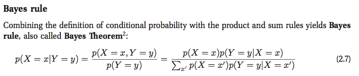

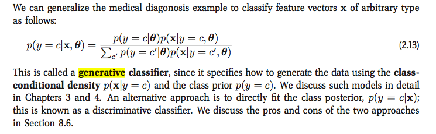

概念：cumulative distribution function，probability density function，quantile(分位点)。具体请参考下图：

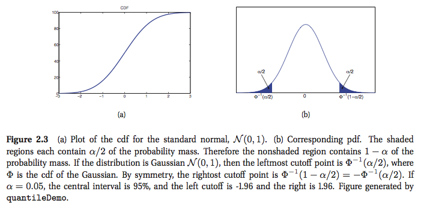

### discrete distributions

binomial distribution:

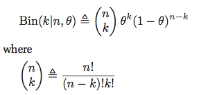

multinomial distribution:

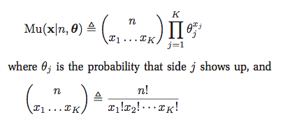

Poisson distribution：

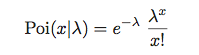

### continuous distributions

Gaussian (normal) distribution:

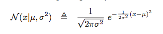

Student t distribution:

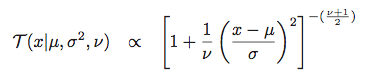

Laplace distribution:

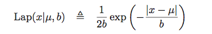

Outliers对Gaussian,Student,Laplace的影响：

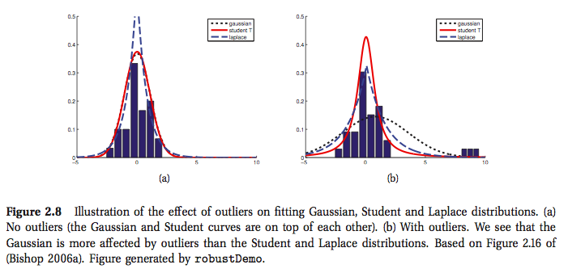

gamma distribution:

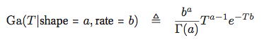
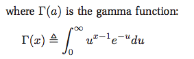

Three distribution:

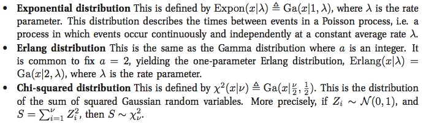

beta distribution:

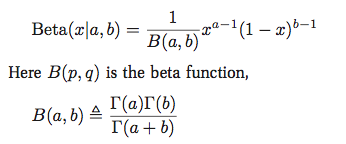

