# 机器学习基石 学习笔记

## 第一讲 Learning problem

有用链接：

- [机器学习基石](https://www.coursera.org/course/ntumlone)
- [机器学习技法](https://class.coursera.org/ntumltwo-001/lecture)
- [beader.me笔记](http://beader.me/mlnotebook/)
- [听课笔记douban](http://www.douban.com/doulist/3440234/)
- [mooc学院](http://mooc.guokr.com/course/610/機器學習基石--Machine-Learning-Foundations-/)

f 表示理想的方案
g 表示求解的用来预测的假设
H：假设空间
X：输入
Y：输出
D：训练集合
A：算法

A takes D and H to get g。通过算法A，利用训练集合D，在假设空间H中选择最好的假设g，选择标准是g近似于f。

**习题**

## 第二讲 Perceptron-感知器

perceptron，感知器。此时h的形式为：h(x) = w*x。感知机（perceptron）是一个线性分类器(linear classifiers），线性分类器的几何表示为：直线，平面，超平面。

注意H是infinite size；

PLA(perceptron learning algorithm)，PLA A takes linear separable D and perceptrons H to get hypothesis g。

上面，PLA算法如果D不是线性可分的，则PLA始终不能收敛。

与简单PLA 的区别：迭代有限次数（提前设定）；随机地寻找分错的数据（而不是循环遍历）；只有当新得到的w 比之前得到的最好的wg 还要好时，才更新wg（这里的好指的是分出来的错误更少）。
由于计算w 后要和之前的wg 比较错误率来决定是否更新wg， 所以pocket algorithm 比简单的PLA 方法要低效。

更多细节请参考 [Perceptron Learning Algorithm- PLA](http://beader.me/2013/12/21/perceptron-learning-algorithm/)

**习题**

## 第三讲 机器学习的分类学

reinforcement learning：广告系统，扑克，棋类游戏。
unsupervised learning：聚类，density estimate，异常检测。
semi-supervised learning：人脸识别，医药效果检测；

batch：填鸭式教学；
online：一条一条的教学；
active：sequentialliy问问题；

[Active learning](http://en.wikipedia.org/wiki/Active_learning_(machine_learning))

**习题**

## 第四讲 学习的可行性分析

机器学习的可行性分析。

- 对于xor问题，perceptron是无解的。所以learning is impossible。如何解决上述存在的问题？ 答：做出合理的假设。

- 霍夫丁不等式(Hoeffding’s Inequality)，下式中v是样本概率；u是总体概率。

- Connection to Learning

面对多个h 做选择时，容易出现问题。比如，某个不好的h 刚好最初的”准确“ 的假象。
随着h 的增加，出现这种假象的概率会增加。

所以，当假设空间有限时（大小为M）时， 当N 足够大，发生BAD sample 的概率非常小。
此时学习是有效的。

更多请参考 [机器学习笔记-机器为何能够学习?](http://beader.me/2014/01/15/is-learning-feasible/)

**习题**

## 第五讲 学习的可行性

学习的可能性：

1. 假设空间H有限（M），且训练数据足够大，则可以保证测试错误率Eout 约等于训练错误率Ein；
2. 如果能得到Ein 接近于零，根据（1），Eout 趋向于零。

以上两条保证的学习的可能性。

M存在重要的trade-off 思想：
（1）当M 很小，那么坏数据出现的概率非常小（见第四讲分析），学习是有效的；但是由于假设空间过小，我们不一定能找到一个方案，可以使训练误差接近零；
（2）反之，若M 很大，因为choices变多，可能找到合适的方案g使E_in(g)=0，但坏数据出现的概率会变大。

**习题**

## 第六讲-第七讲 归纳理论，VC维

关于VC维，请参考独立文章[VC维的来龙去脉](http://zzbased.github.io/2015/03/07/VC维的来龙去脉.html)

**习题**

## 第八讲 噪音与错误

带权重的分类

采用Pocket 方法，然而计算错误时对待两种错误(false reject/false accept) 不再一视同仁，false acceot 比false reject 严重1000倍。通过下面方法解决：

在训练开始前，我们将{(x,y) | y=-1} 的数据复制1000倍之后再开始学习，后面的步骤与传统的pocket 方法一模一样。

然而，从效率、计算资源的角度考虑，通常不会真的将y=-1 的数据拷贝1000倍，实际中一般采用"virtual copying"。只要保证：
randomly check -1 example mistakes with 1000 times more probability.

更多请参考 [机器学习笔记-Noise and Error](http://beader.me/2014/03/02/noise-and-error/)

**习题**

## 第九讲 线性回归

线性回归假设的思想是：寻找这样的直线/平面/超平面，使得输入数据的残差最小。
通常采用的error measure 是squared error。

线性回归用矩阵表示如下:

求导数，使导数为0，即可求得最优解

Ein和Eout都向σ2(noise level)收敛，并且他们之间的差异被2(d+1)/N给bound住了。有点像VC bound，不过要比VC bound来的更严格一些。

一个直观的想法，能否利用linear regression来做linear classification?

之所以能够通过线程回归的方法来进行二值分类，是由于回归的squared error 是分类的0/1 error 的上界，我们通过优化squared error，一定程度上也能得到不错的分类结果；或者，更好的选择是，将回归方法得到的w 作为二值分类模型的初始w 值。

更多请参考 [机器学习笔记-Linear Regression](http://beader.me/2014/03/09/linear-regression/) [豆瓣笔记](http://www.douban.com/note/323611077/)

**习题**

## 第十讲 逻辑回归

比较深刻的点有：

似然函数的推导。

推导得到Cross-Entropy Error

之所以说最优的v 是与梯度相反的方向，想象一下：如果一条直线的斜率k>0，说明向右是上升的方向，应该向左走；反之，斜率k<0，向右走。

解决的方向问题，步幅也很重要。步子太小的话，速度太慢；过大的话，容易发生抖动，可能到不了谷底。
显然，距离谷底较远（位置较高）时，步幅大些比较好；接近谷底时，步幅小些比较好（以免跨过界）。距离谷底的远近可以通过梯度（斜率）的数值大小间接反映，接近谷底时，坡度会减小。
因此，我们希望步幅与梯度数值大小正相关。

更多请参考 [机器学习笔记-Logistic Regression](http://beader.me/2014/05/03/logistic-regression/)

**习题**

## 第十一讲  线性分类模型

我们了解到线性回归和逻辑斯蒂回归一定程度上都可以用于线性二值分类，因为它们对应的错误衡量(square error, cross-entropy) 都是“0/1 error” 的上界。

本质上讲，线性分类（感知机）、线性回归、逻辑斯蒂回归都属于线性模型，因为它们的核心都是一个线性score 函数：s=w^T*x

只是三个model 对其做了不同处理：
线性分类对s 取符号；线性回归直接使用s 的值；逻辑斯蒂回归将s 映射到(0,1) 区间。

**多类别分类**

方法有两个：

一种直观的解决方法是将其转化为多轮的二值分类问题：任意选择一个类作为+1，其他类都看做-1，在此条件下对原数据进行训练，得到w；经过多轮训练之后，得到多个w。对于某个x，将其分到可能性最大的那个类。（例如逻辑斯蒂回归对于x 属于某个类会有一个概率估计）
如果target 是k 个类标签，我们需要k 轮训练，得到k 个w。
这种方法叫做One-Versus-All (OVA)。

另一种方法叫做One-Versus-One(OVO)，对比上面的OVA 方法。
基本方法：每轮训练时，任取两个类别，一个作为+1，另一个作为-1，其他类别的数据不考虑，这样，同样用二值分类的方法进行训练；目标类有k个时，需要 k*(k-1)/2 轮训练，得到 k*(k-1)/2 个分类器。
预测：对于某个x，用训练得到的 k*(k-1)/2 个分类器分别对其进行预测，哪个类别被预测的次数最多，就把它作为最终结果。即通过“循环赛”的方式来决定哪个“类”是冠军。

OVA 和 OVO 方法的思想都很简单，可以作为以后面对多值分类问题时的备选方案，并且可以为我们提供解决问题的思路。

更多请参考[线性分类模型 (台大机器学习）](http://www.douban.com/note/325298034/)

**习题**

## 第十二讲 非线性转换

这里的非线性转换其实也是特征转换(feature transform)，在特征工程里很常见。

x-空间的数据转换到z-空间之后，新的假设中的参数数量也比传统线性假设多了许多。
经过非线性转换后，VC维将增大。

高次假设对数据拟合得更充分，Ein 更小；然而，由于付出的模型复杂度代价逐渐增加，Eout 并不是一直随着Ein 减小。

更多请参考[笔记](http://www.douban.com/note/325308691/)

**习题**

## 第十三讲 过拟合 - Overfitting

更多请参考[笔记](http://www.douban.com/note/325443925/)

## 第十四讲 正规化-Regularization

原来的优化问题是NP-Hard 的。如果对w 进行更soft/smooth 的约束，可以使其更容易优化：

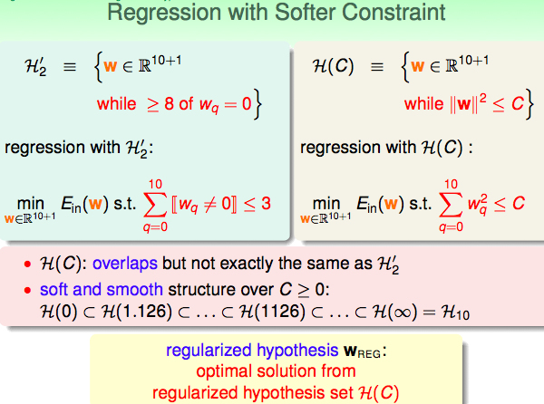

利用lagrange multiplier做regularization，得到下面式子：

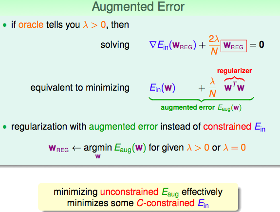

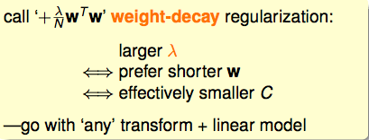

总之，lambda 越大，对应的常数C 越小，模型越倾向于选择更小的w 向量。
这种正规化成为 weight-decay regularization，它对于线性模型以及进行了非线性转换的线性假设都是有效的。

**正规化与VC 理论**

根据VC Bound 理论，Ein 与 Eout 的差距是模型的复杂度。也就是说，假设越复杂（dvc 越大），Eout 与 Ein 相差就越大，违背了我们学习的意愿。
对于某个复杂的假设空间H，dvc 可能很大；通过正规化，原假设空间变为正规化的假设空间H(C)。与H 相比，H(C) 是受正规化的“约束”的，因此实际上H(C) 没有H 那么大，也就是说H(C) 的VC维比原H 的VC维要小。因此，Eout 与 Ein 的差距变小。:-)

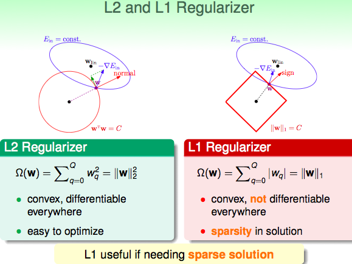

上图解释了为什么L1有稀疏解。

lambda 当然不是越大越好！选择合适的lambda 也很重要，它受到随机噪音和确定性噪音的影响。

更多请参考[笔记](http://www.douban.com/note/325451389/)

# 机器学习技巧 学习笔记

## 第1讲 Linear Support Vector Machines

我们的目标是：最大间隔

求一个点x距离一个平面的距离：

点x到平面上的点x'的向量 x-x'，在平面的法向量上的投影：w*(x-x')/|w|，即|w^T*x+b|/|w|。

最大化这个距离，可以假设 min{y*(wx+b)}=1。那么目标变为：

max 1/|w|  条件是： min{y*(wx+b)}=1

进一步推导，得到最终优化的目标：

min 1/2 w*w^T  subject to y(wx+b)>=1

这就是支持向量机的优化目标，它的损失函数，等同于： max{0, 1-ywx}

注意：函数间隔与几何间隔。

可以讲这个优化目标转化到 [二次规划 quadratic programming](http://cn.mathworks.com/discovery/quadratic-programming.html)

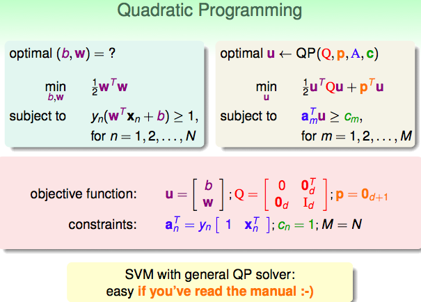

large-margin algorithm的VC维分析。因为large margin的限制，相比于较于PLA，svm的dichotomies会更少。所以从VC维看，相比于PLA，其泛化能力更强。

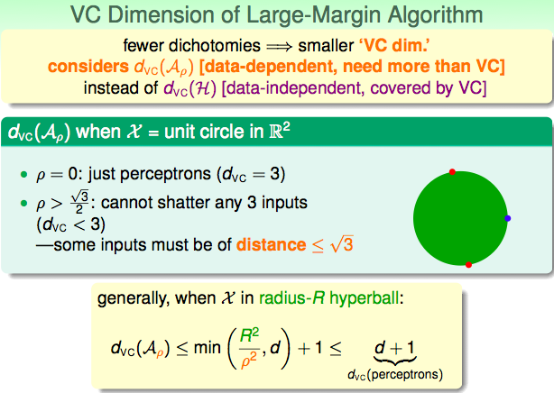

large-margin hyperplanes：参数最少，所以boundary最简单。
一般的hyperplanes：参数适中，边界简单。
一般的hyperplanes+feature转换(非线性的)：参数较多，边界复杂。
large-margin hyperplanes+feature transform：则可以得到适中的参数个数，复杂的边界。

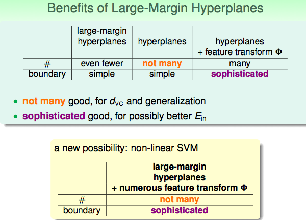

**习题**

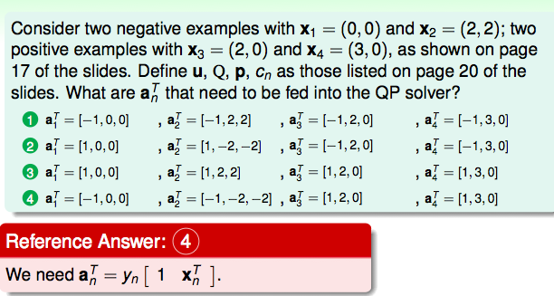
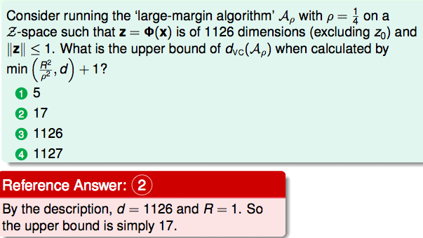

## 第2讲 Dual support vector machine

讨论： Support Vector Classification，Logistic Regression，Support Vector Regression的区别：

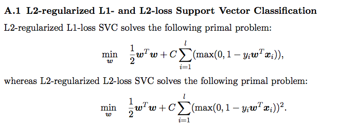

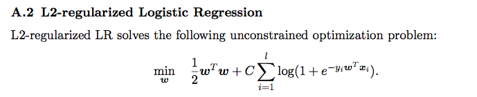

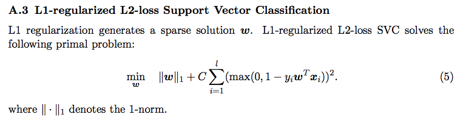

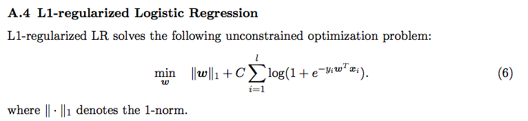

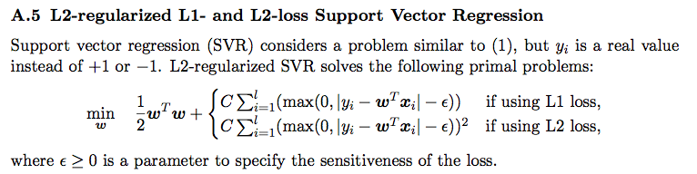

复习一下第1讲，直接求解SVM的original问题，利用QP方法，需要求解 d+1个变量(d指代feature转换后的维度)，N个约束条件。如果我们采用一个非线性变换，维度特别高，就不太可解了，所以我们想SVM without d。所以有 ‘Equivalent’ SVM: based on some dual problem of Original SVM。

这时就要用到lagrange multipliers。这里看下正则化，为什么正则化的表达式是这样的，这是通过lagrange multipliers。

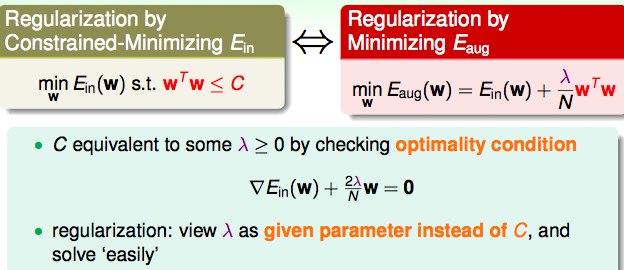

下面是SVM的对偶问题推导过程：

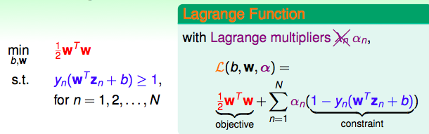

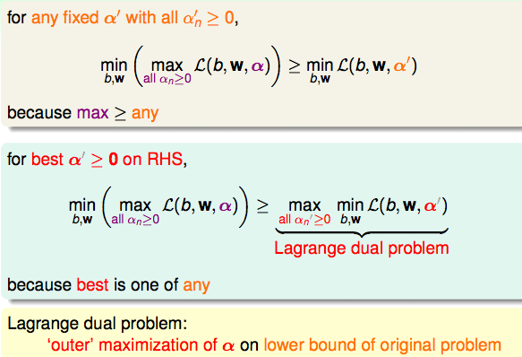

这里要提一下KKT条件：

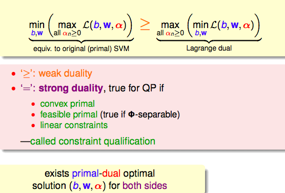

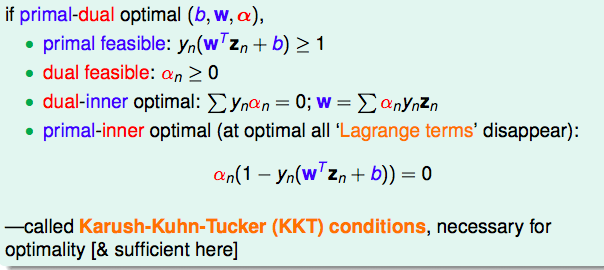

经过一通推导，我们得到了svm的对偶问题：

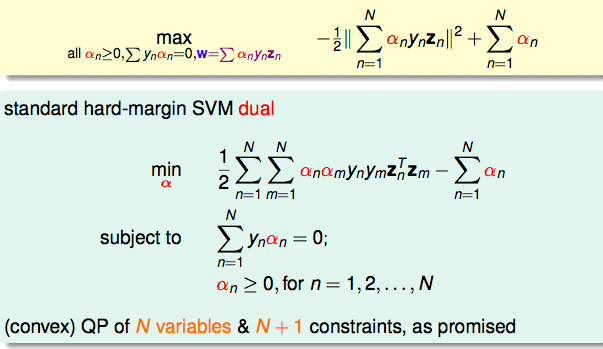

这个对偶问题，就可以用QP来求解了。

求得a后，primal问题的w和b，可以通过下面式子求得：

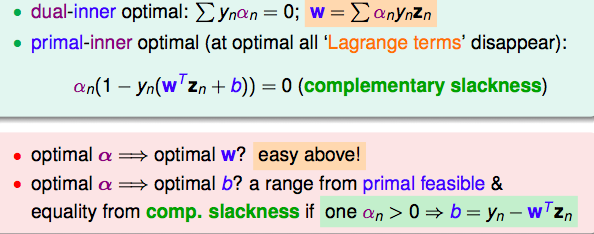

最后说一个解释：当a_n大于0时，此时该点正好处于边界上，这也就是所谓的支撑向量。

有趣之处在于，对于新点x的预测，只需要计算它与训练数据点的内积即可（表示向量内积），这一点至关重要，是之后使用 Kernel 进行非线性推广的基本前提。此外，所谓 Supporting Vector 也在这里显示出来——事实上，所有非Supporting Vector 所对应的系数都是等于零的，因此对于新点的内积计算实际上只要针对少量的“支持向量”而不是所有的训练数据即可。

**习题**

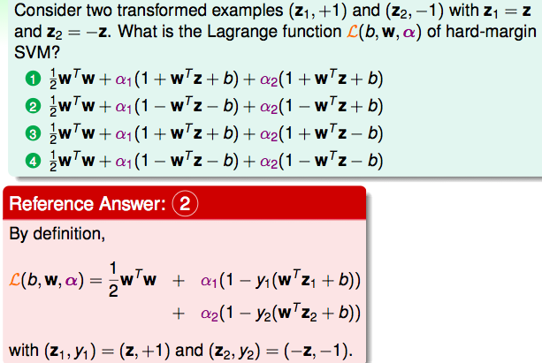
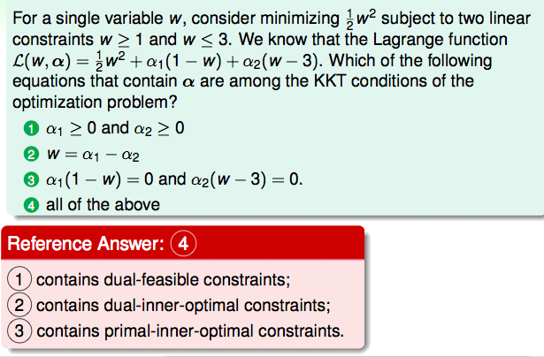
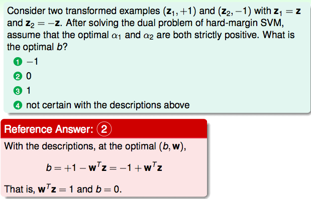
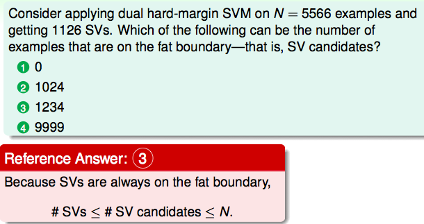

## 第3讲
为什么要把SVM转换到对偶问题，原因有这样几个：1.对偶问题的变量为N个，有时候N远远小于d。2.解释了support vector。 3.比较直观的引入了核函数。

在线性不可分的情况下，支持向量机首先在低维空间中完成计算，然后通过核函数将输入空间映射到高维特征空间，最终在高维特征空间中构造出最优分离超平面，从而把平面上本身不好分的非线性数据分开。

建立非线性学习器分为两步：
首先使用一个非线性映射将数据变换到一个特征空间F，
然后在特征空间使用线性学习器分类。

核函数的优势在于：
一个是映射到高维空间中，然后再根据内积的公式进行计算；
而另一个则直接在原来的低维空间中进行计算，而不需要显式地写出映射后的结果。

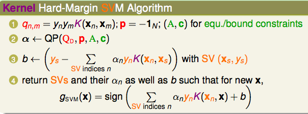

多项式核：

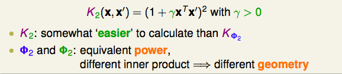

SVM + Polynomial Kernel: Polynomial SVM

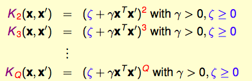

高斯核：

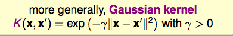

看一下高斯核参数改变带来的变化：

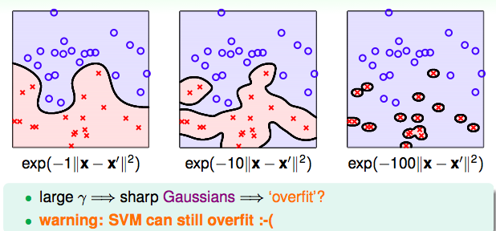

下面对比一下常用的几种核函数：

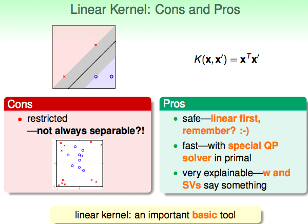
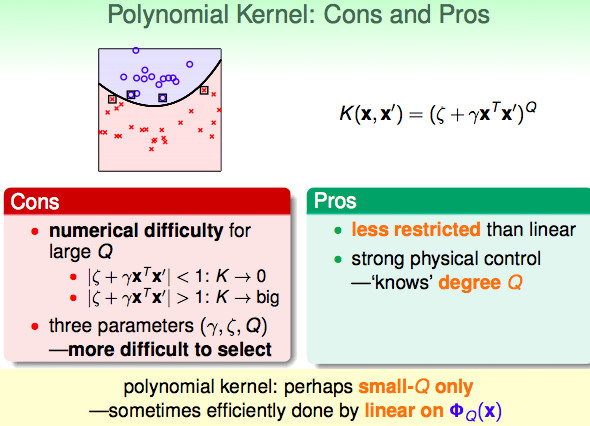
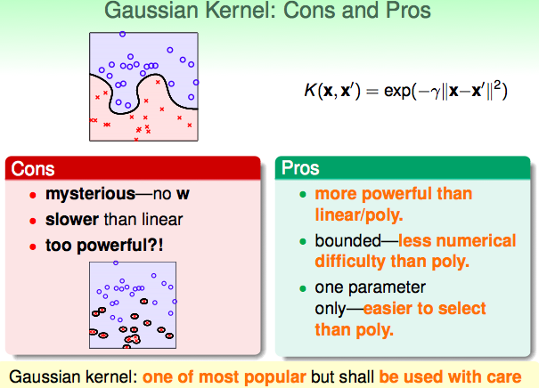

当然，除了上面三种常用的核函数外，还可以自己构造一些核，只需要这些核满足mercer's condition。不过需要说明的，很难。

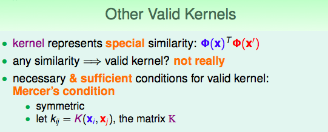

**习题**

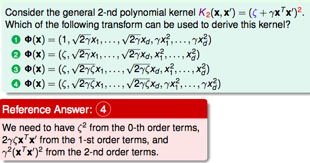

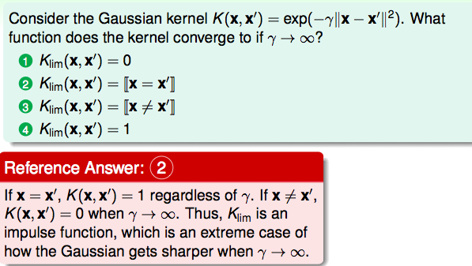

## 第4讲

使用松弛变量处理 outliers 方法，本讲的内容。

## 第6讲  Blending and Bagging

Aggregation的方法包括：select, mix uniformly, mix non-uniformly, combine;
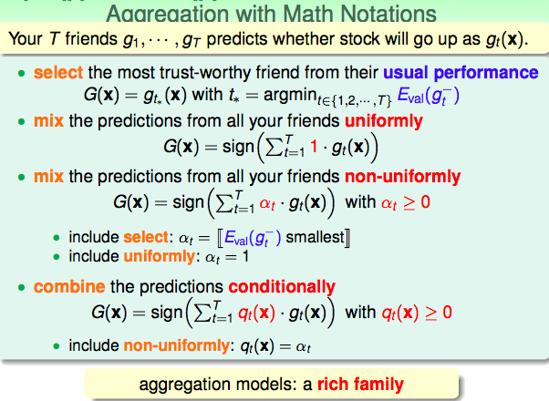

为什么Aggregation方法是有效的？可以从两方面来看，其一通过Aggregation可以生成复杂的hypotheses，相当于做了feature transform；其二，生成的G(x)更加moderate，例如下图中PLA的uniform mix就是large-margin，相当于做了regularization。

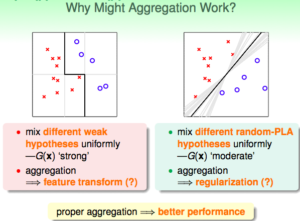

**uniform blending**

如果是classification，则有：

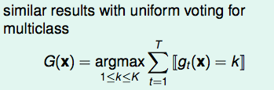

如果是regression，则有：

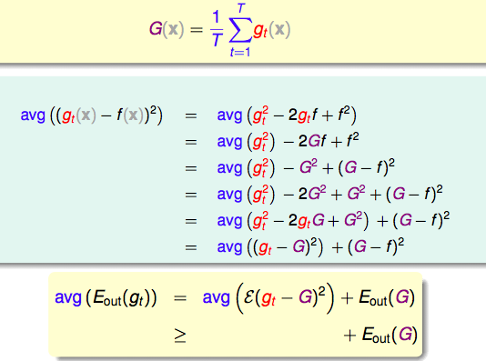

从上图还可以看出：任意g的Eout平均大于等于G的Eout。

从上图的公式还可以得出，expected performance of A = expected deviation to consensus +performance of consensus。

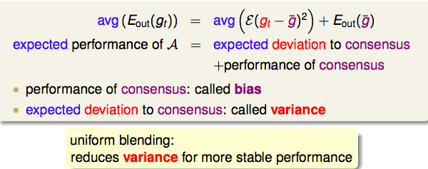

**Linear Blending**

linear blending就像two-level learning。

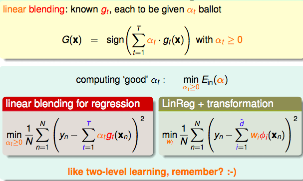

like selection, blending practically done with (Eval instead of Ein) + (gt− from minimum Etrain)

Any blending也叫Stacking。

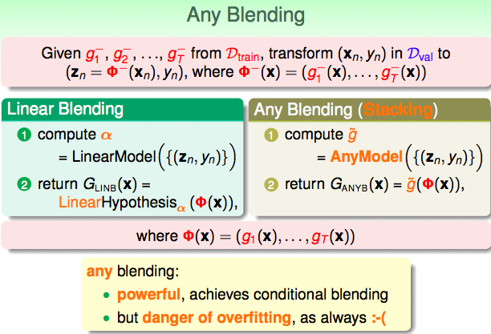

**bagging**

aggregation里最重要的一个点就是：diversity。diversity的方法有很多种。

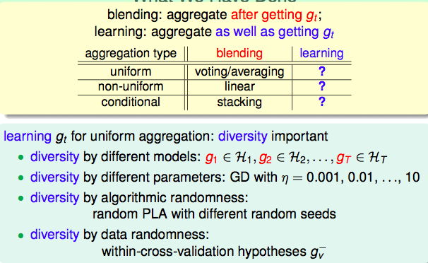

下面介绍一种通过data randomness的方法，也叫bootstrapping，即bagging。

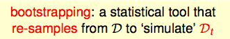

**习题**

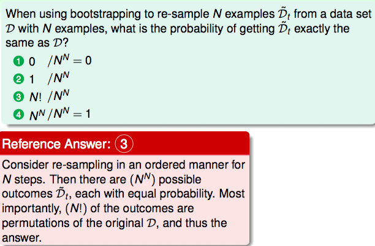

## 第8讲 Adaptive Boosting

课程的最开始有一个分辨苹果的例子。以后AdaBoost的时候可以借鉴那个例子。其基本思路是：给予上次分错的样本更高的权重。

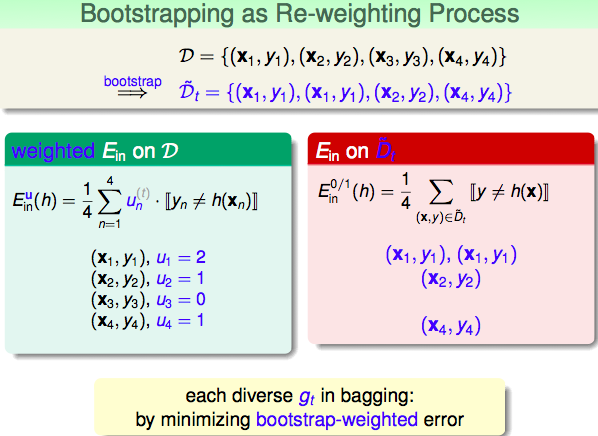

给每个example不同的weight，类似于给予不同的class的样本不同的weight。回忆一下，有时候我们false reject尽可能低，那对于这一类，我们在error measure给予更高的权重。

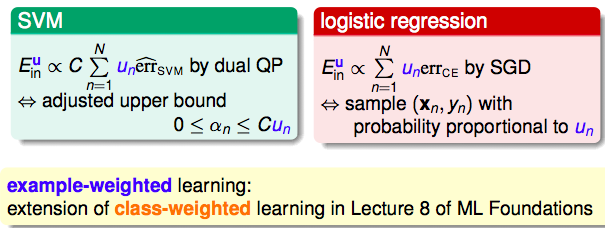

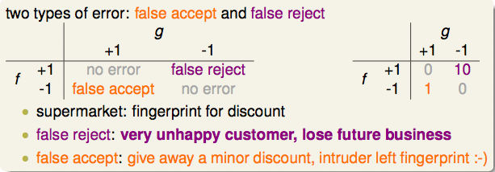

具体怎么更新下一次训练的样本权重呢，参考下面的图：

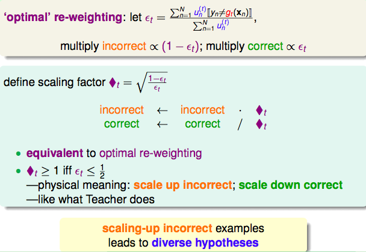

有了样本权重更新公式后，则有一个Preliminary算法：

得到这么多的g后，怎么得到G，也就是aggregation的方法，我们希望在计算g的时候把aggregation的权重也得到。

那么完整算法为：

下面是一些理论：

Decision Stump

AdaBoost与Decision Stump的结合 -- > AdaBoost-Stump:
efficient feature selection and aggregation

**习题**

## 第9讲 Decision Tree

decision tree的位置，模仿人脑决策过程。

decision tree缺点：(1)启发式的规则(前人的巧思)，缺乏理论基础；(2)启发式规则很多，需要selection；(3)没有代表性的算法。

一个基本的decision tree算法：

CART: classification and regression tree。
有两个简单的选择：binary tree；叶子节点是常数。

怎么选择branching，切完后两个子树的纯度最高。

怎么考量"不纯度"

最终CART算法如下：

关于CART算法的演算过程，具体请参考 [决策树算法的计算过程演示](http://mydisk.com/yzlv/webpage/datamining/xiti.html)，[Decision tree learning](http://en.wikipedia.org/wiki/Decision_tree_learning)，[An example of calculating gini gain in CART](http://www.academia.edu/7032069/An_example_of_calculating_gini_gain_in_CART)

几种决策树算法的区别：

C4.5算法是在ID3算法的基础上采用信息增益率的方法选择测试属性。 ID3算法和C4.5算法虽然在对训练样本集的学习中可以尽可能多地挖掘信息，但其生成的决策树分支较大，规模较大。为了简化决策树的规模，提高生成决策树的效率，又出现了根据GINI系数来选择测试属性的决策树算法CART。
CART算法采用一种二分递归分割的技术，与基于信息熵的算法不同，CART算法对每次样本集的划分计算GINI系数，GINI系数，GINI系数越小则划分越合理。CART算法总是将当前样本集分割为两个子样本集，使得生成的决策树的每个非叶结点都只有两个分枝。因此CART算法生成的决策树是结构简洁的二叉树。

Regularization

当有categorical features时，CART也可以灵活处理。

如果有缺失特征的话，怎么办？可以利用surrogate feature。

看一个CART的例子：

**习题** 

## 第10讲 random forest

## 第12讲 神经网络

**Motivation**

通过"Linear Aggregation of Perceptrons"，可以完成AND，OR，NOT等操作，可以完成 convex set等操作，但是不能完成XOR操作。怎么办？只能multi-layer perceptron。

XOR(g1, g2) = OR(AND(−g1, g2), AND(g1, −g2))

perceptron (simple)
=⇒ aggregation of perceptrons (powerful)
=⇒ multi-layer perceptrons (more powerful)

**Neural Network Hypothesis**

output：any linear model can be used；
transformation function of score (signal) s：不用linear，因为多层线性=>whole network linear。也不用阶梯函数(0-1)，因为它不可微。通常的选择有tanh(x)，sigmoid(s)。

tanh(x) = [exp(s)-exp(-s)] / [exp(s)+exp(-s)] = 2sigmoid(2x)-1

**Backpropagation**

**Optimization**

当multiple hidden layers，一般都是non-convex。对于最优化来说，不容易求得全局最优解。GD/SGD可能只能求出局部最优解。

对Wij做不同的初始化，可能有不同的局部最优解。所以对初始化值比较敏感。

有效的建议是：不要初始化太大的weights，因为large weight，加上tanh后，将saturate。如果做梯度下降的话，那段区域里有small gradient。所以建议要try some random&small ones。

神经网络的dVC=O(VD)，V表示神经元的个数，D表示weight的个数，也就是edge的数目。

VC维太大，容易overfit。可以加一个L2 regularizer。但是加L2后，带来的只是shrink weights。我们希望可以得到sparse解，那么就可以用L1 regularizer，但L1不可微分。
所以另外一个选择是：weight-elimination（scaled L2），即large weight → median shrink; small weight → median shrink

Early Stopping，随着t 增长，VC维越大。所以合适的t 就够了。

## 第13讲 Deep Learning

structural decisions: key issue for applying NNet。模型结构很关键。

hinton 2006提出的：

Auto-encoder的作用：监督学习的话，给予做特征；无监督学习的话，用来做密度预测，也可以用来做异常点检测。

Regularization in Deep Learning的方法：

- structural decisions/constraints，譬如卷积神经网络，循环神经网络
- weight decay or weight elimination regularizers
- Early stopping
- dropout，dropconnect等
- denosing

Linear Autoencoder Hypothesis

未完待续，PCA

**习题**

