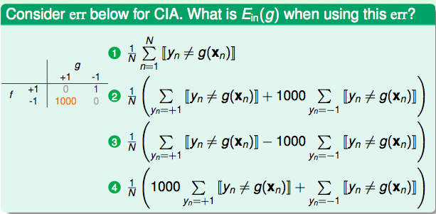

# 机器学习基石 学习笔记

## 第一讲 Learning problem

有用链接：

- [机器学习基石](https://www.coursera.org/course/ntumlone)
- [机器学习技法](https://class.coursera.org/ntumltwo-001/lecture)
- [beader.me笔记](http://beader.me/mlnotebook/)
- [听课笔记douban](http://www.douban.com/doulist/3440234/)
- [mooc学院](http://mooc.guokr.com/course/610/機器學習基石--Machine-Learning-Foundations-/)

f 表示理想的方案
g 表示求解的用来预测的假设
H：假设空间
X：输入
Y：输出
D：训练集合
A：算法

A takes D and H to get g。通过算法A，利用训练集合D，在假设空间H中选择最好的假设g，选择标准是g近似于f。

## 第二讲 Perceptron-感知器

perceptron，感知器。此时h的形式为：h(x) = w*x。感知机（perceptron）是一个线性分类器(linear classifiers），线性分类器的几何表示为：直线，平面，超平面。

注意H是infinite size；

PLA(perceptron learning algorithm)，PLA A takes linear separable D and perceptrons H to get hypothesis g。

上面，PLA算法如果D不是线性可分的，则PLA始终不能收敛。

与简单PLA 的区别：迭代有限次数（提前设定）；随机地寻找分错的数据（而不是循环遍历）；只有当新得到的w 比之前得到的最好的wg 还要好时，才更新wg（这里的好指的是分出来的错误更少）。
由于计算w 后要和之前的wg 比较错误率来决定是否更新wg， 所以pocket algorithm 比简单的PLA 方法要低效。

更多细节请参考 [Perceptron Learning Algorithm- PLA](http://beader.me/2013/12/21/perceptron-learning-algorithm/)

## 第三讲 机器学习的分类学

reinforcement learning：广告系统，扑克，棋类游戏。
unsupervised learning：聚类，density estimate，异常检测。
semi-supervised learning：人脸识别，医药效果检测；

batch：填鸭式教学；
online：一条一条的教学；
active：sequentialliy问问题；

[Active learning](http://en.wikipedia.org/wiki/Active_learning_(machine_learning))

## 第四讲 学习的可行性分析

机器学习的可行性分析。

- 对于xor问题，perceptron是无解的。所以learning is impossible。如何解决上述存在的问题？ 答：做出合理的假设。

- 霍夫丁不等式(Hoeffding’s Inequality)，下式中v是样本概率；u是总体概率。

- Connection to Learning

面对多个h 做选择时，容易出现问题。比如，某个不好的h 刚好最初的”准确“ 的假象。
随着h 的增加，出现这种假象的概率会增加。

所以，当假设空间有限时（大小为M）时， 当N 足够大，发生BAD sample 的概率非常小。
此时学习是有效的。

更多请参考 [机器学习笔记-机器为何能够学习?](http://beader.me/2014/01/15/is-learning-feasible/)

## 第五讲 学习的可行性

学习的可能性：

1. 假设空间H有限（M），且训练数据足够大，则可以保证测试错误率Eout 约等于训练错误率Ein；
2. 如果能得到Ein 接近于零，根据（1），Eout 趋向于零。

以上两条保证的学习的可能性。

M存在重要的trade-off 思想：
（1）当M 很小，那么坏数据出现的概率非常小（见第四讲分析），学习是有效的；但是由于假设空间过小，我们不一定能找到一个方案，可以使训练误差接近零；
（2）反之，若M 很大，因为choices变多，可能找到合适的方案g使E_in(g)=0，但坏数据出现的概率会变大。

## 第六讲-第七讲 归纳理论，VC维

关于VC维，请参考独立文章[VC维的来龙去脉](http://zzbased.github.io/2015/03/07/VC维的来龙去脉.html)

## 第八讲 噪音与错误

带权重的分类

采用Pocket 方法，然而计算错误时对待两种错误(false reject/false accept) 不再一视同仁，false acceot 比false reject 严重1000倍。通过下面方法解决：

在训练开始前，我们将{(x,y) | y=-1} 的数据复制1000倍之后再开始学习，后面的步骤与传统的pocket 方法一模一样。

然而，从效率、计算资源的角度考虑，通常不会真的将y=-1 的数据拷贝1000倍，实际中一般采用"virtual copying"。只要保证：
randomly check -1 example mistakes with 1000 times more probability.

更多请参考 [机器学习笔记-Noise and Error](http://beader.me/2014/03/02/noise-and-error/)

## 第九讲 线性回归

线性回归假设的思想是：寻找这样的直线/平面/超平面，使得输入数据的残差最小。
通常采用的error measure 是squared error。

更多请参考 [机器学习笔记-Linear Regression](http://beader.me/2014/03/09/linear-regression/) [豆瓣笔记](http://www.douban.com/note/323611077/)

## 第十讲 逻辑回归

更多请参考 [机器学习笔记-Logistic Regression](http://beader.me/2014/05/03/logistic-regression/) 

