# 机器学习基石 学习笔记

## 第一讲 Learning problem

有用链接：

- [机器学习基石](https://www.coursera.org/course/ntumlone)
- [机器学习技法](https://class.coursera.org/ntumltwo-001/lecture)
- [beader.me笔记](http://beader.me/mlnotebook/)
- [听课笔记douban](http://www.douban.com/doulist/3440234/)
- [mooc学院](http://mooc.guokr.com/course/610/機器學習基石--Machine-Learning-Foundations-/)

f 表示理想的方案
g 表示求解的用来预测的假设
H：假设空间
X：输入
Y：输出
D：训练集合
A：算法

A takes D and H to get g。通过算法A，利用训练集合D，在假设空间H中选择最好的假设g，选择标准是g近似于f。

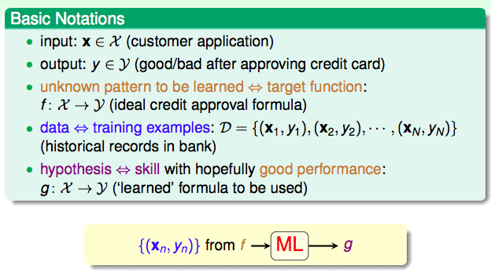

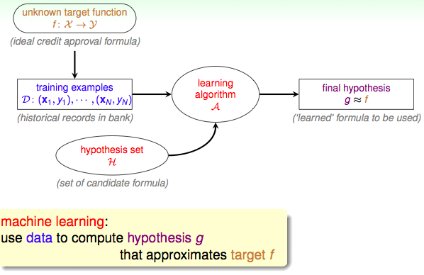

**习题**

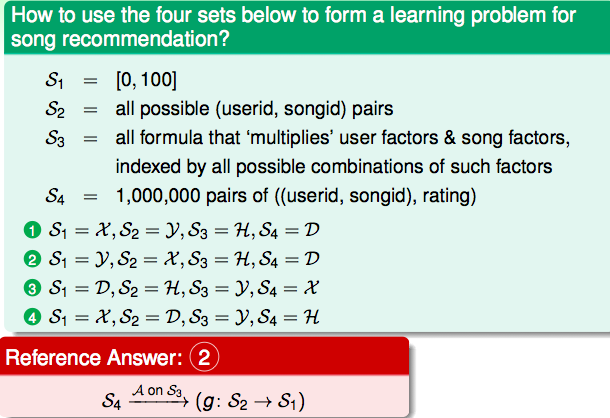

## 第二讲 Perceptron-感知器

perceptron，感知器。此时h的形式为：h(x) = w*x。感知机（perceptron）是一个线性分类器(linear classifiers），线性分类器的几何表示为：直线，平面，超平面。

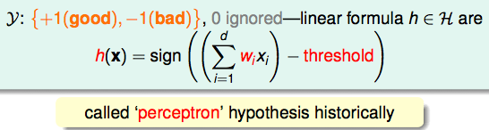

注意H是infinite size；

PLA(perceptron learning algorithm)，PLA A takes linear separable D and perceptrons H to get hypothesis g。

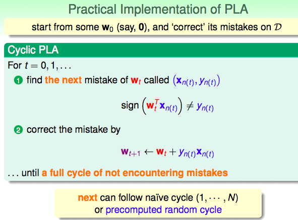

上面，PLA算法如果D不是线性可分的，则PLA始终不能收敛。

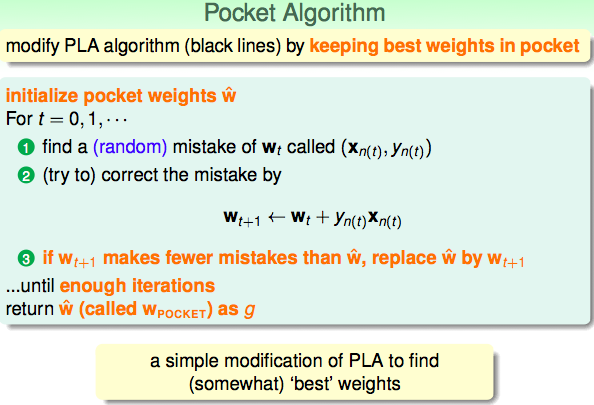

与简单PLA 的区别：迭代有限次数（提前设定）；随机地寻找分错的数据（而不是循环遍历）；只有当新得到的w 比之前得到的最好的wg 还要好时，才更新wg（这里的好指的是分出来的错误更少）。
由于计算w 后要和之前的wg 比较错误率来决定是否更新wg， 所以pocket algorithm 比简单的PLA 方法要低效。

更多细节请参考 [Perceptron Learning Algorithm- PLA](http://beader.me/2013/12/21/perceptron-learning-algorithm/)

**习题**

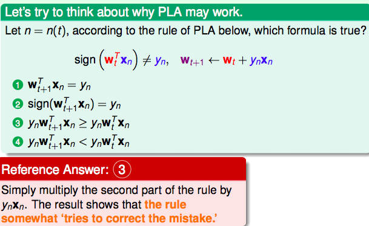
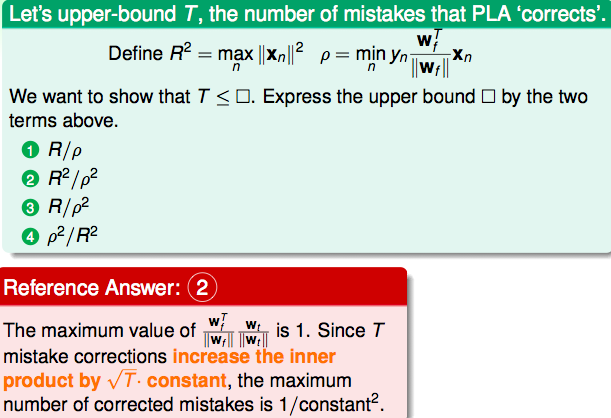
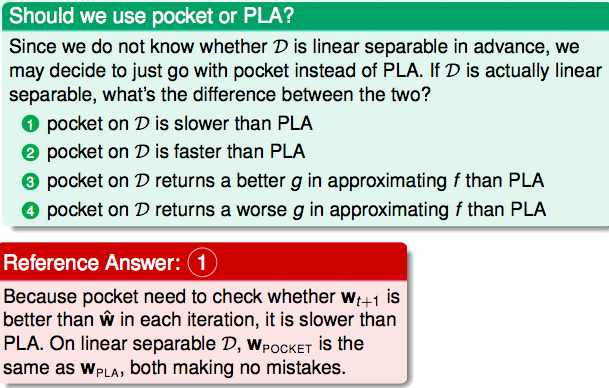

## 第三讲 机器学习的分类学

reinforcement learning：广告系统，扑克，棋类游戏。
unsupervised learning：聚类，density estimate，异常检测。
semi-supervised learning：人脸识别，医药效果检测；

batch：填鸭式教学；
online：一条一条的教学；
active：sequentialliy问问题；

[Active learning](http://en.wikipedia.org/wiki/Active_learning_(machine_learning))

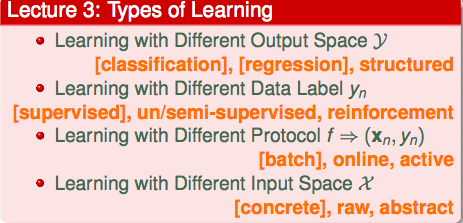

**习题**

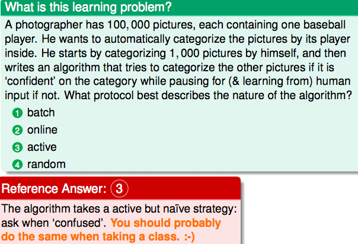

## 第四讲 学习的可行性分析

机器学习的可行性分析。

- 对于xor问题，perceptron是无解的。所以learning is impossible。如何解决上述存在的问题？ 答：做出合理的假设。

- 霍夫丁不等式(Hoeffding’s Inequality)，下式中v是样本概率；u是总体概率。

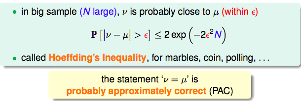

- Connection to Learning

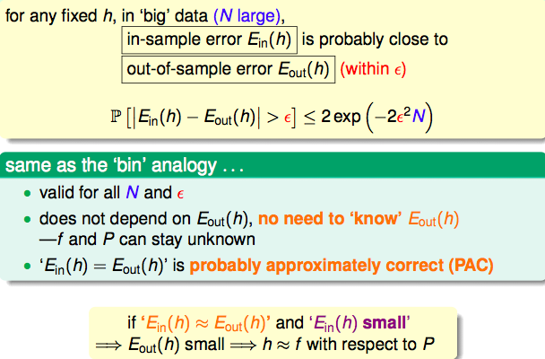

面对多个h 做选择时，容易出现问题。比如，某个不好的h 刚好最初的”准确“ 的假象。
随着h 的增加，出现这种假象的概率会增加。

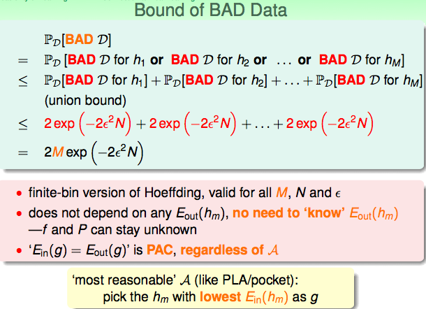

所以，当假设空间有限时（大小为M）时， 当N 足够大，发生BAD sample 的概率非常小。
此时学习是有效的。

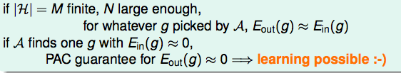

更多请参考 [机器学习笔记-机器为何能够学习?](http://beader.me/2014/01/15/is-learning-feasible/)

**习题**

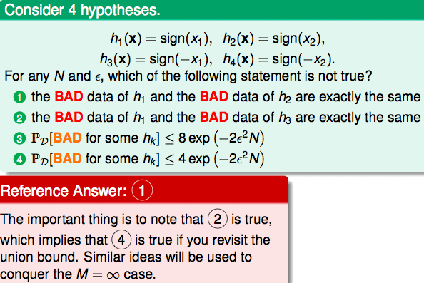

## 第五讲 学习的可行性

学习的可能性：

1. 假设空间H有限（M），且训练数据足够大，则可以保证测试错误率Eout 约等于训练错误率Ein；
2. 如果能得到Ein 接近于零，根据（1），Eout 趋向于零。

以上两条保证的学习的可能性。

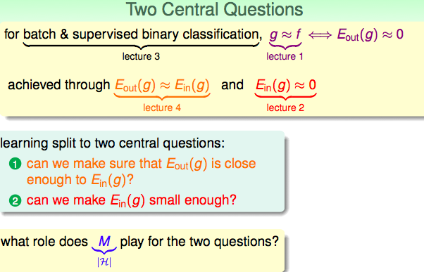

M存在重要的trade-off 思想：
（1）当M 很小，那么坏数据出现的概率非常小（见第四讲分析），学习是有效的；但是由于假设空间过小，我们不一定能找到一个方案，可以使训练误差接近零；
（2）反之，若M 很大，因为choices变多，可能找到合适的方案g使E_in(g)=0，但坏数据出现的概率会变大。

**习题**

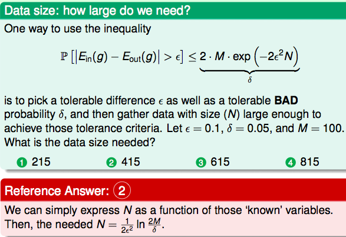
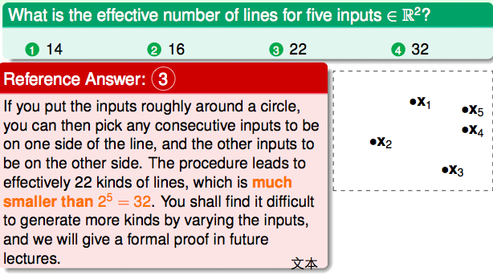
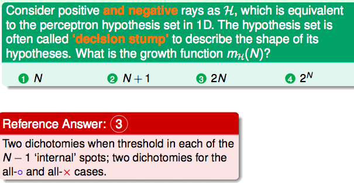
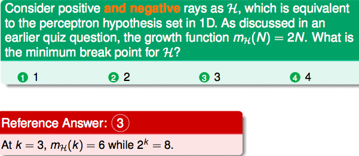

## 第六讲-第七讲 归纳理论，VC维

关于VC维，请参考独立文章[VC维的来龙去脉](http://zzbased.github.io/2015/03/07/VC维的来龙去脉.html)

**习题**

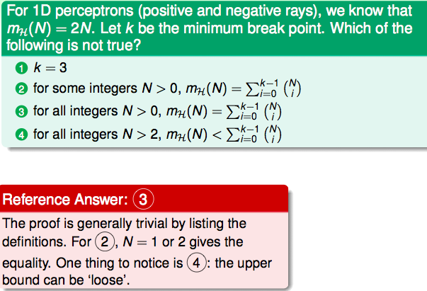
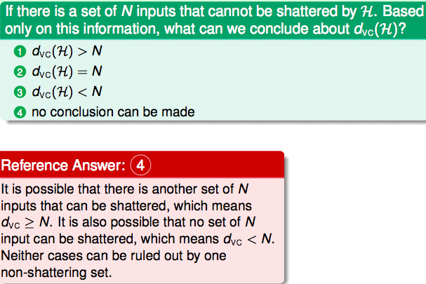

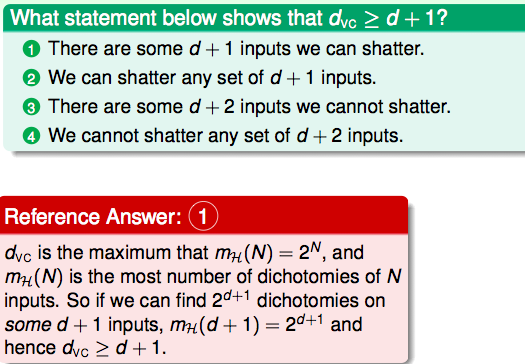
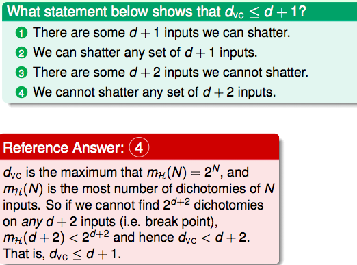
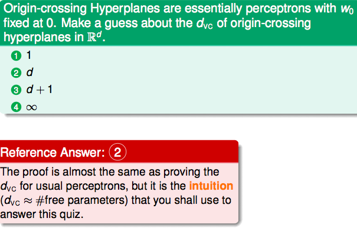
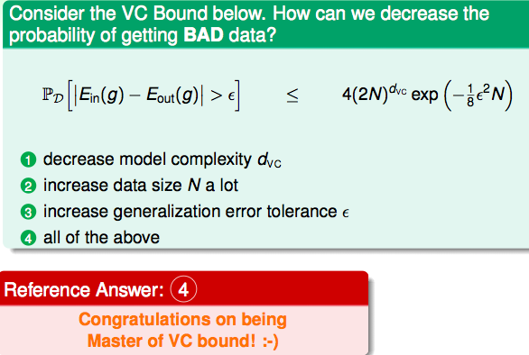

## 第八讲 噪音与错误

带权重的分类

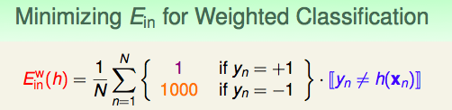

采用Pocket 方法，然而计算错误时对待两种错误(false reject/false accept) 不再一视同仁，false acceot 比false reject 严重1000倍。通过下面方法解决：

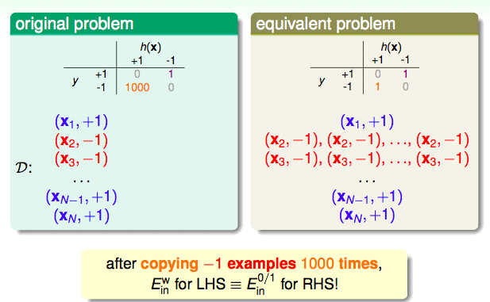

在训练开始前，我们将{(x,y) | y=-1} 的数据复制1000倍之后再开始学习，后面的步骤与传统的pocket 方法一模一样。

然而，从效率、计算资源的角度考虑，通常不会真的将y=-1 的数据拷贝1000倍，实际中一般采用"virtual copying"。只要保证：
randomly check -1 example mistakes with 1000 times more probability.

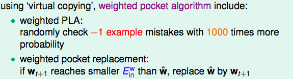

更多请参考 [机器学习笔记-Noise and Error](http://beader.me/2014/03/02/noise-and-error/)

**习题**

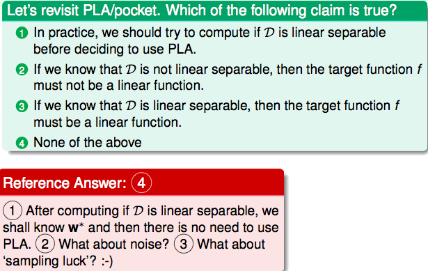
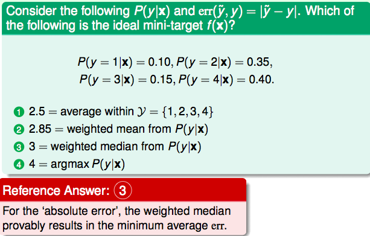
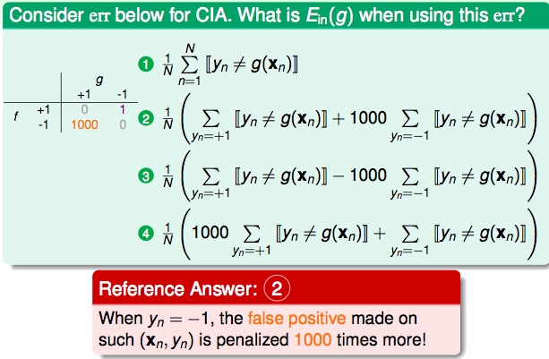
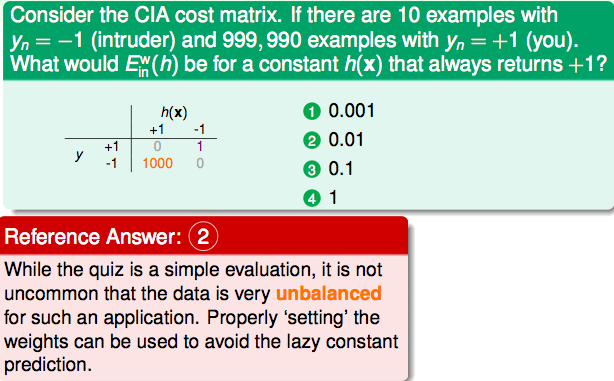

## 第九讲 线性回归

线性回归假设的思想是：寻找这样的直线/平面/超平面，使得输入数据的残差最小。
通常采用的error measure 是squared error。

线性回归用矩阵表示如下:

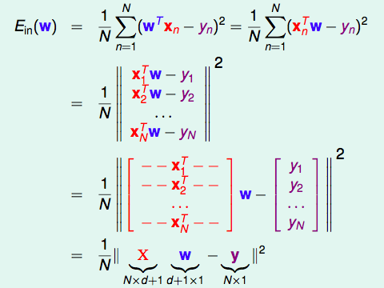

求导数，使导数为0，即可求得最优解

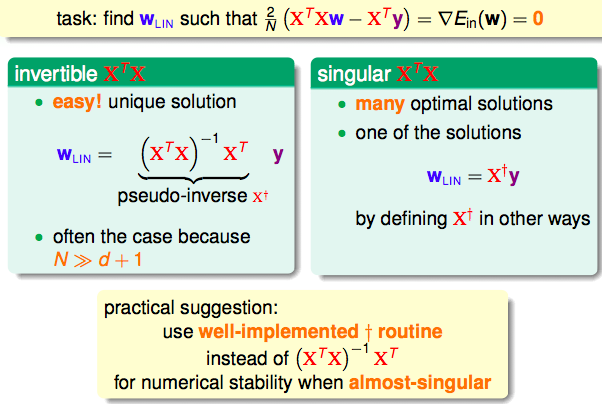

Ein和Eout都向σ2(noise level)收敛，并且他们之间的差异被2(d+1)/N给bound住了。有点像VC bound，不过要比VC bound来的更严格一些。

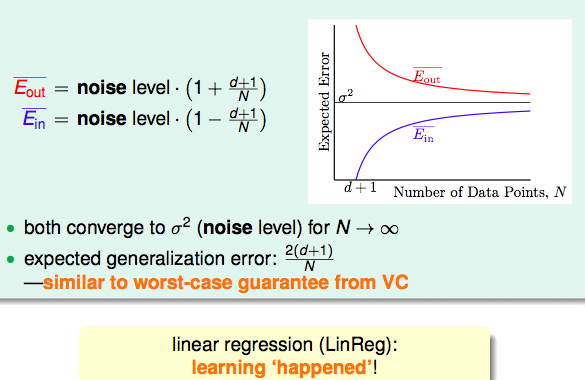

一个直观的想法，能否利用linear regression来做linear classification?

之所以能够通过线程回归的方法来进行二值分类，是由于回归的squared error 是分类的0/1 error 的上界，我们通过优化squared error，一定程度上也能得到不错的分类结果；或者，更好的选择是，将回归方法得到的w 作为二值分类模型的初始w 值。

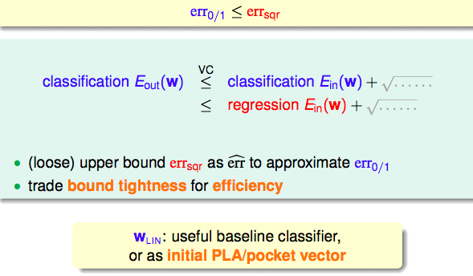

更多请参考 [机器学习笔记-Linear Regression](http://beader.me/2014/03/09/linear-regression/) [豆瓣笔记](http://www.douban.com/note/323611077/)

**习题**

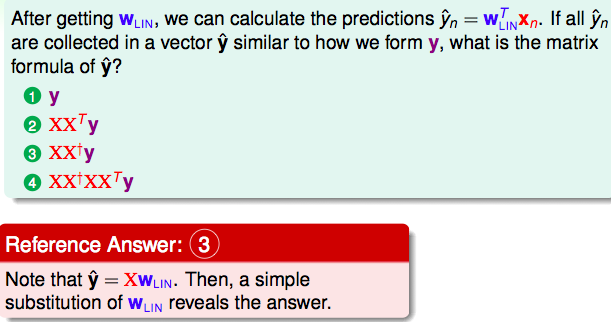

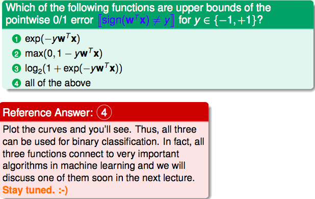

## 第十讲 逻辑回归

比较深刻的点有：

似然函数的推导。

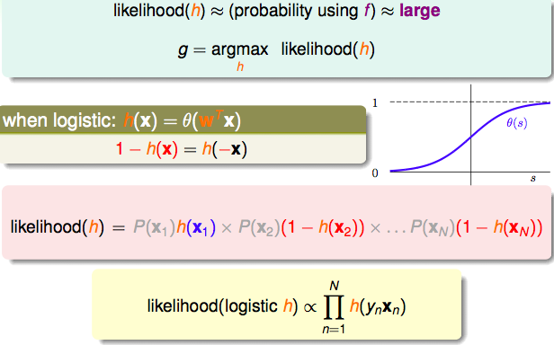 
推导得到Cross-Entropy Error

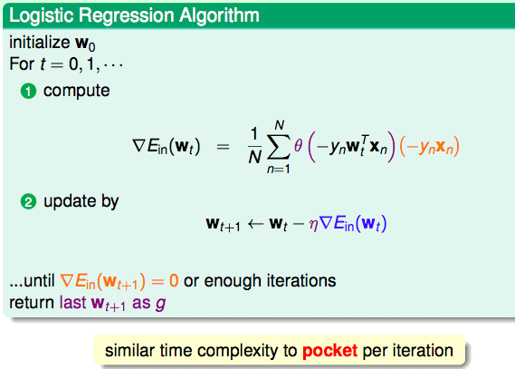

之所以说最优的v 是与梯度相反的方向，想象一下：如果一条直线的斜率k>0，说明向右是上升的方向，应该向左走；反之，斜率k<0，向右走。

解决的方向问题，步幅也很重要。步子太小的话，速度太慢；过大的话，容易发生抖动，可能到不了谷底。
显然，距离谷底较远（位置较高）时，步幅大些比较好；接近谷底时，步幅小些比较好（以免跨过界）。距离谷底的远近可以通过梯度（斜率）的数值大小间接反映，接近谷底时，坡度会减小。
因此，我们希望步幅与梯度数值大小正相关。

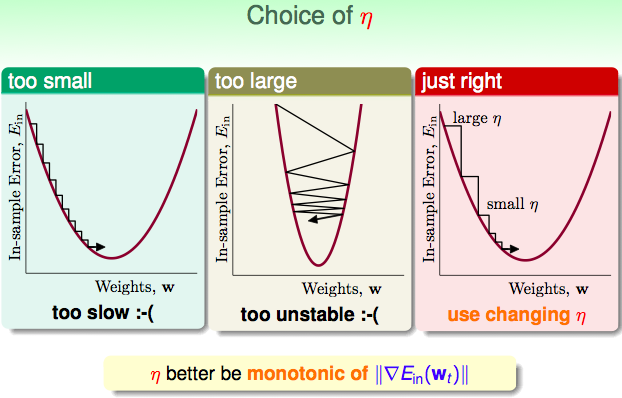

更多请参考 [机器学习笔记-Logistic Regression](http://beader.me/2014/05/03/logistic-regression/) 

**习题**

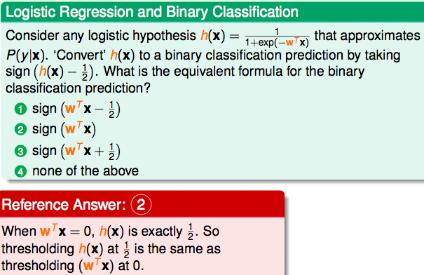
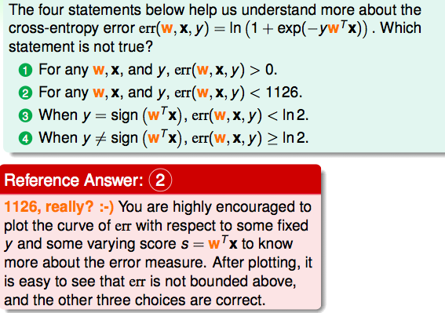
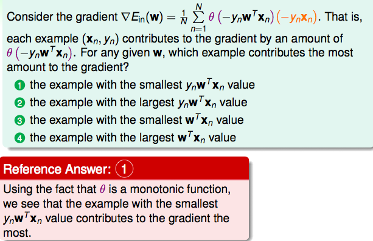
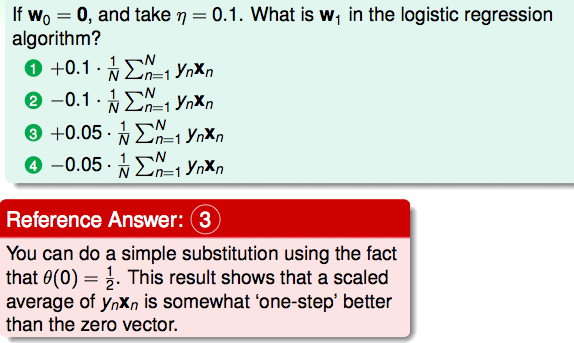

## 第十一讲  线性分类模型

我们了解到线性回归和逻辑斯蒂回归一定程度上都可以用于线性二值分类，因为它们对应的错误衡量(square error, cross-entropy) 都是“0/1 error” 的上界。

本质上讲，线性分类（感知机）、线性回归、逻辑斯蒂回归都属于线性模型，因为它们的核心都是一个线性score 函数：s=w^T*x

只是三个model 对其做了不同处理：
线性分类对s 取符号；线性回归直接使用s 的值；逻辑斯蒂回归将s 映射到(0,1) 区间。

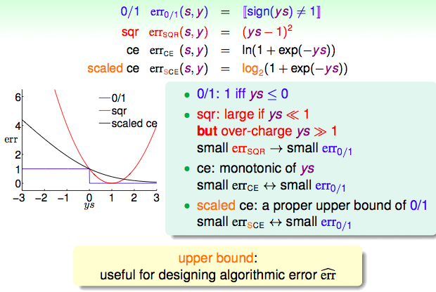

**多类别分类**

方法有两个：

一种直观的解决方法是将其转化为多轮的二值分类问题：任意选择一个类作为+1，其他类都看做-1，在此条件下对原数据进行训练，得到w；经过多轮训练之后，得到多个w。对于某个x，将其分到可能性最大的那个类。（例如逻辑斯蒂回归对于x 属于某个类会有一个概率估计）
如果target 是k 个类标签，我们需要k 轮训练，得到k 个w。
这种方法叫做One-Versus-All (OVA)。

另一种方法叫做One-Versus-One(OVO)，对比上面的OVA 方法。
基本方法：每轮训练时，任取两个类别，一个作为+1，另一个作为-1，其他类别的数据不考虑，这样，同样用二值分类的方法进行训练；目标类有k个时，需要 k*(k-1)/2 轮训练，得到 k*(k-1)/2 个分类器。
预测：对于某个x，用训练得到的 k*(k-1)/2 个分类器分别对其进行预测，哪个类别被预测的次数最多，就把它作为最终结果。即通过“循环赛”的方式来决定哪个“类”是冠军。

OVA 和 OVO 方法的思想都很简单，可以作为以后面对多值分类问题时的备选方案，并且可以为我们提供解决问题的思路。

更多请参考[线性分类模型 (台大机器学习）](http://www.douban.com/note/325298034/)

**习题**

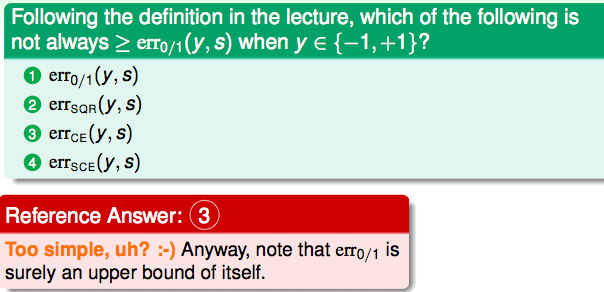
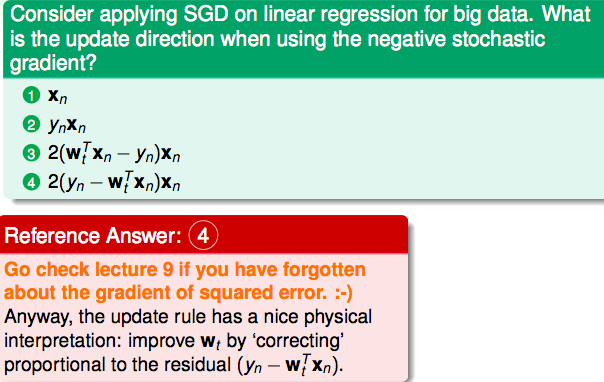
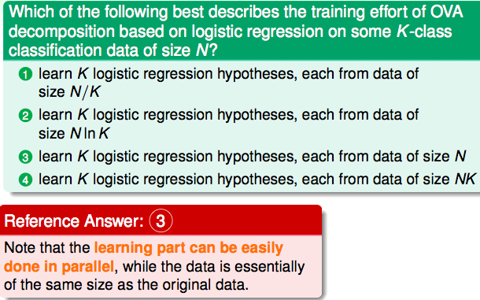
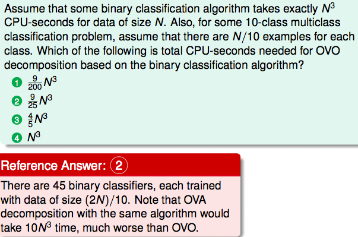

## 第十二讲 非线性转换

这里的非线性转换其实也是特征转换(feature transform)，在特征工程里很常见。

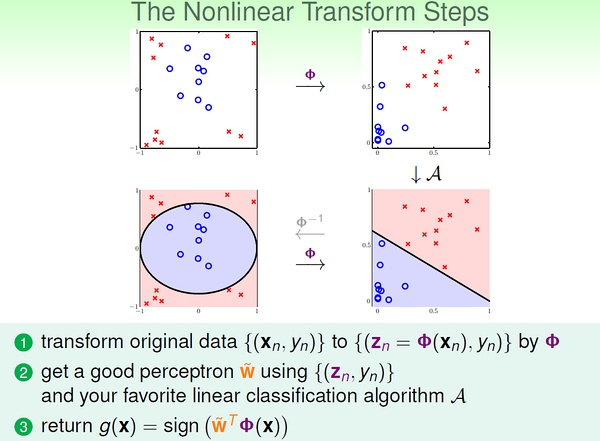

x-空间的数据转换到z-空间之后，新的假设中的参数数量也比传统线性假设多了许多。
经过非线性转换后，VC维将增大。

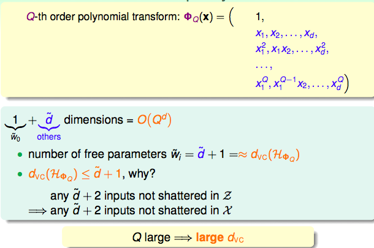

高次假设对数据拟合得更充分，Ein 更小；然而，由于付出的模型复杂度代价逐渐增加，Eout 并不是一直随着Ein 减小。

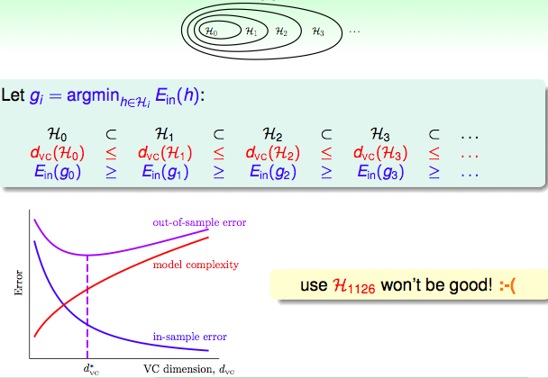

更多请参考[笔记](http://www.douban.com/note/325308691/)

**习题**

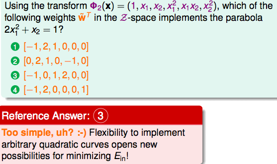
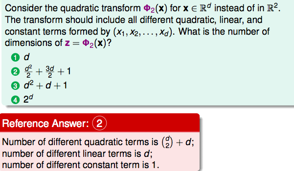

## 第十三讲 过拟合 - Overfitting

更多请参考[笔记](http://www.douban.com/note/325443925/)

## 第十四讲 正规化-Regularization

更多请参考[笔记](http://www.douban.com/note/325451389/)

## 第12讲 神经网络

**Motivation**

通过"Linear Aggregation of Perceptrons"，可以完成AND，OR，NOT等操作，可以完成 convex set等操作，但是不能完成XOR操作。怎么办？只能multi-layer perceptron。

XOR(g1, g2) = OR(AND(−g1, g2), AND(g1, −g2))

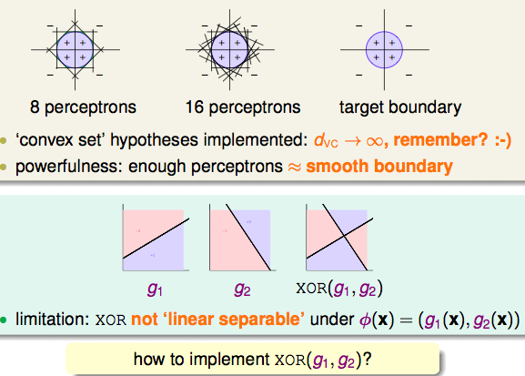

perceptron (simple)
=⇒ aggregation of perceptrons (powerful) 
=⇒ multi-layer perceptrons (more powerful)

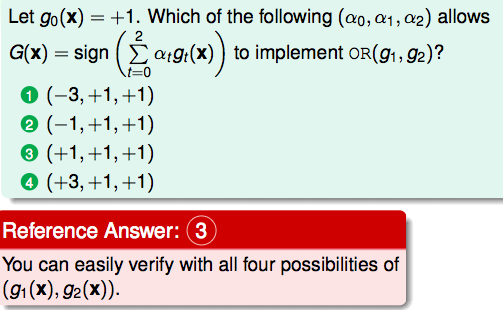

**Neural Network Hypothesis**

output：any linear model can be used；
transformation function of score (signal) s：不用linear，因为多层线性=>whole network linear。也不用阶梯函数(0-1)，因为它不可微。通常的选择有tanh(x)，sigmoid(s)。

tanh(x) = [exp(s)-exp(-s)] / [exp(s)+exp(-s)] = 2sigmoid(2x)-1

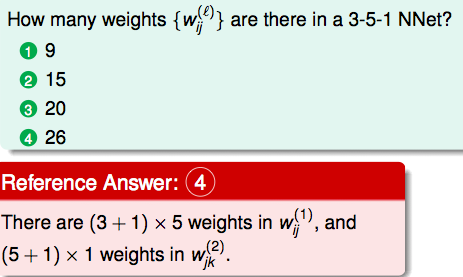

**Backpropagation**

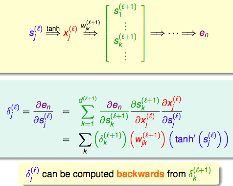

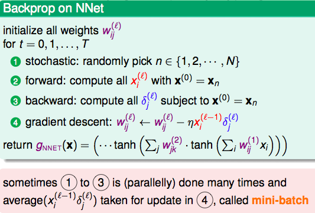

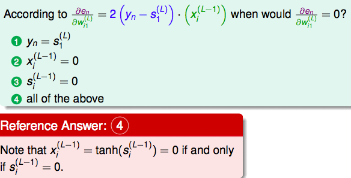

**Optimization**

当multiple hidden layers，一般都是non-convex。对于最优化来说，不容易求得全局最优解。GD/SGD可能只能求出局部最优解。

对Wij做不同的初始化，可能有不同的局部最优解。所以对初始化值比较敏感。

有效的建议是：不要初始化太大的weights，因为large weight，加上tanh后，将saturate。如果做梯度下降的话，那段区域里有small gradient。所以建议要try some random&small ones。

神经网络的dVC=O(VD)，V表示神经元的个数，D表示weight的个数，也就是edge的数目。

VC维太大，容易overfit。可以加一个L2 regularizer。但是加L2后，带来的只是shrink weights。我们希望可以得到sparse解，那么就可以用L1 regularizer，但L1不可微分。
所以另外一个选择是：weight-elimination（scaled L2），即large weight → median shrink; small weight → median shrink

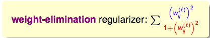

Early Stopping，随着t 增长，VC维越大。所以合适的t 就够了。

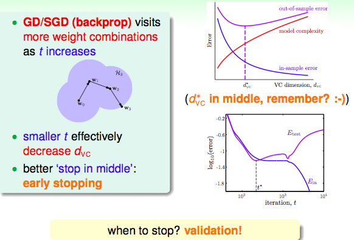

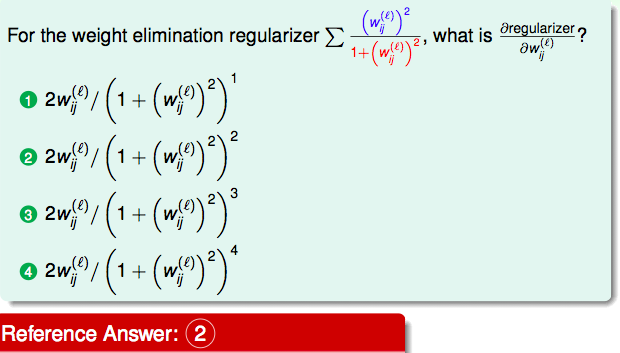
	

## 第13讲 Deep Learning

structural decisions: key issue for applying NNet。模型结构很关键。

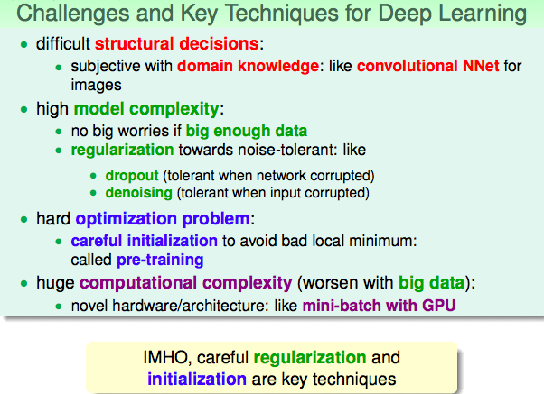

hinton 2006提出的：

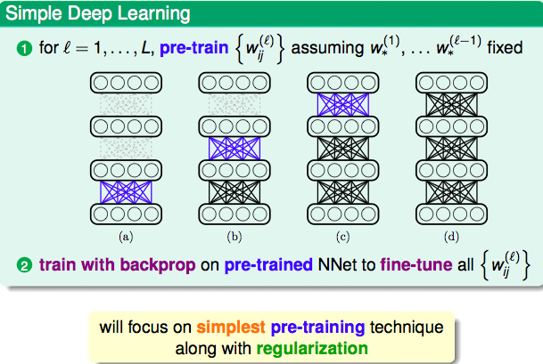

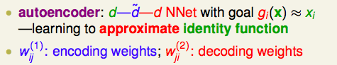

Auto-encoder的作用：监督学习的话，给予做特征；无监督学习的话，用来做密度预测，也可以用来做异常点检测。

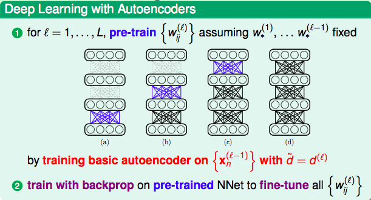

Regularization in Deep Learning的方法：

- structural decisions/constraints，譬如卷积神经网络，循环神经网络
- weight decay or weight elimination regularizers
- Early stopping
- dropout，dropconnect等
- denosing

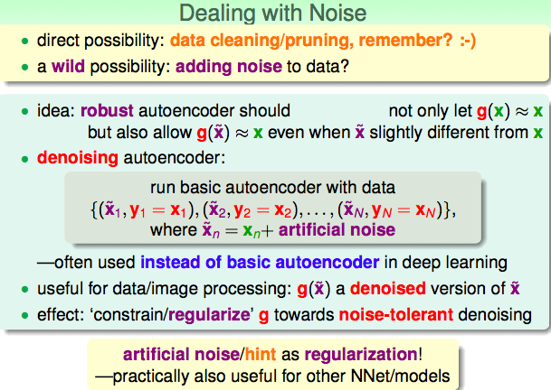

Linear Autoencoder Hypothesis
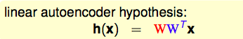

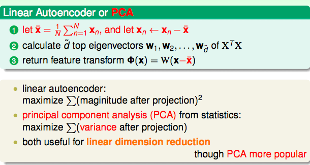

**习题**

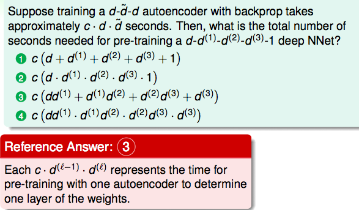
